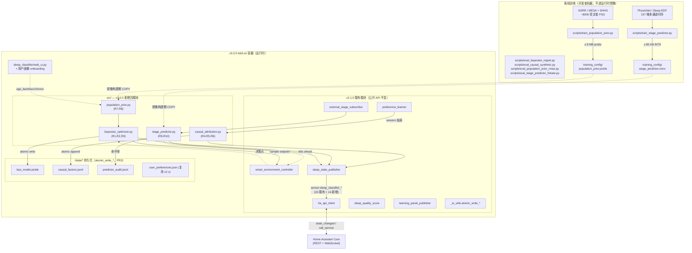
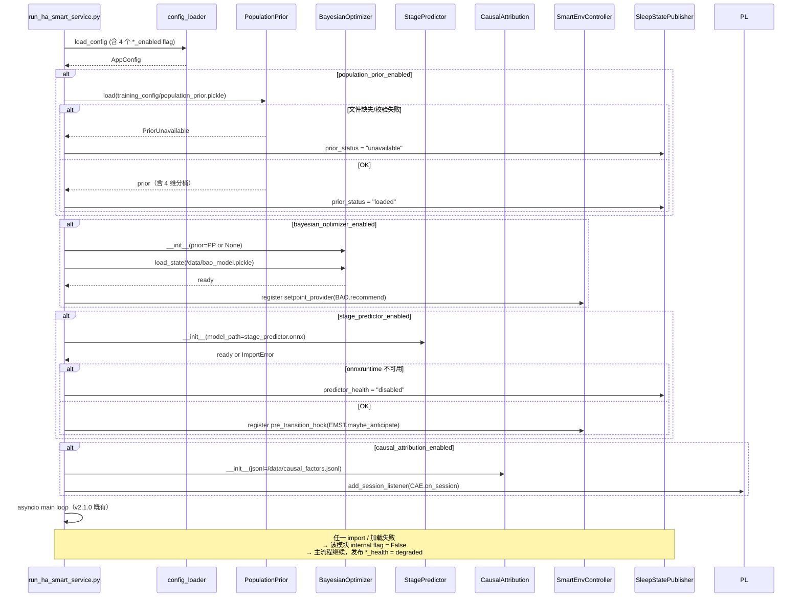
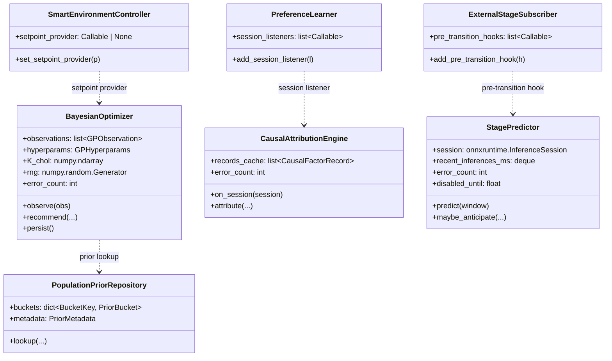

# Design Document

> Spec: algorithmic-moat-v3.0.0
> Workflow: requirements-first（feature spec）
> 关联：`.kiro/specs/algorithmic-moat-v3.0.0/requirements.md`、上一轮 `commercial-readiness-v2.1.0`

## Overview

v2.1.0 把 add-on 推到了「装得上、不崩、有合规与品牌」的商业可发布线，但其核心算法（加权中位数 + k-NN + deadband + per-stage delta）仍属可在 2 周内复刻的工程实现，**没有可证明的技术壁垒**。requirements.md 把 v3.0.0 的护城河形式化成 4 个独立但配套的算法方向（BAO / CAE / PP / EMST）+ 6 条横切契约（PR1–PR6）+ 12 条可验证 property（P1–P12）。

本设计文档要解决的核心问题是：**在不破坏 v2.1.0 行为契约（dry_run / feature flag / sensor schema / 持久化路径 / 优雅降级）和 PR1-PR6 不变量的前提下，把 4 个算法模块以最小耦合的方式接入既有 asyncio 主循环，并明确 v3.1.0 联邦扩展的 forward-compat 钩子**。

设计上的最大权衡：

1. **首次破例引入重型科学计算依赖**。`numpy / scipy / onnxruntime` 三件套是 BAO（GP cholesky）、CAE（bootstrap CI）、EMST（INT8 推理）的事实标准；自实现既不可信也不可维护。代价是镜像基线从 ~15 MB 升到 ~80 MB（PR4），但通过 `--only-binary=:all:` + Alpine musllinux wheel + CI 体积守护把上限钉死在 96 MB。
2. **PP 路径桥接冷启动而非真·联邦学习**。requirements.md 已显式把 federated learning 推迟到 v3.1.0；本期把 MESA + SHHS 的 PSG 训练成 hierarchical Bayesian prior 当作离线"出厂数据"，pickle 进镜像（≤ 8 MB），运行时只读不写、不上传。这让冷启动从 7 晚压到 1 晚，同时让 v3.1.0 的 FedAvg 有现成的 wire format。
3. **4 个算法模块全部以"加层"方式接入**。`preference_learner` / `smart_environment_controller` / `sleep_state_publisher` / `ha_api_client` / `_io_utils` 五个 v2.x 既有模块的**公开签名**保持不变；BAO 在决策点之前包一层 GP+TS、CAE 在 session 结束后挂一个 hook、PP 在启动期注入 prior、EMST 在 stage 切换前以 try/except 提前调用。任一新模块 import 失败、加载失败、或运行时异常 ≥ 3 次即降级到 v2.1.0 行为（R11）。
4. **数学保证表述统一加假设前缀**。requirements 中 R3.5 / R6.5 / R15.3 已经禁止夸大临床效果；design 同步要求所有 README / DOCS / sensor explanation 表述为"在 RBF kernel + 加性噪声假设下成立"、"在 IID 假设下成立"，禁止裸写"4 周收敛"或"提升睡眠质量 30%"。

工程量估计（不含训练数据采购）：**约 40% 算法实现 + 25% 训练脚本 + 15% 健康监控/sensor + 10% CI 体积守护 + 10% 文档/伦理**。运行时核心模块（preference_learner、smart_environment_controller、ha_api_client）**新增 hook 接口但不修改既有公共 API**，是 PR1 / PR2 不变量的物理保证。

## Architecture

### 2.1 v2.1.0 既有架构（保留不动）

```
HA WebSocket (state_changed)             HA REST (/api/services/...)
       │                                            ▲
       ▼                                            │
ExternalStageSubscriber                             │
       │ SleepStage + debounced transitions        │
       ▼                                            │
SmartEnvironmentController ──► per-stage planner    │
       │     (per-actuator anticipation)            │
       ▼                                            │
PreferenceLearner ◄── /data/user_preferences.json   │
       │     (k-NN + 加权中位数, 纯函数)              │
       ▼                                            │
SleepStatePublisher / LearningPanelPublisher ───────┘
       (sensor.sleep_classifier_*  ×20)
```

### 2.2 v3.0.0 新增组件全景



关键点：

1. **"加层"集成原则**：PP / BAO / CAE / EMST 4 个新模块均通过 v2.x 既有模块对外**已存在的公开方法**接入，而非内部修改。例：
   - BAO 通过 `SmartEnvironmentController.set_setpoint_provider(callable)` 注册一个 callable 替代 `PreferenceLearner.recommend()` 的直接调用；callable 失败 / 抛错时退回 `recommend()`。
   - CAE 通过 `PreferenceLearner.add_session_listener(callable)` 在 session 持久化后被异步调用；不阻塞主循环。
   - EMST 通过 `ExternalStageSubscriber.add_pre_transition_hook(callable)` 在 stage 切换被 debouncer 接受前 50 ms 内触发。
   - PP 仅在启动期被 BAO 调用一次，运行时不再交互。
2. **网络出口零增加**。v3.0.0 的所有计算都在本地完成；除 v2.1.0 已有的 telemetry / upgrade-notifier，无新出站请求（PR3 + R14 隐私契约）。
3. **持久化新文件全部走 `_io_utils.atomic_write_*`**（PR3）。`bao_model.pickle` 用 `atomic_write_bytes`（新增），`causal_factors.jsonl` / `predictor_audit.jsonl` 用 `atomic_append_jsonl`（新增）。
4. **训练时依赖与运行时依赖严格隔离**（R12.5）。`scripts/train_*.py` 用到的 `torch / pandas / pyEDFlib / onnx / nsrr-toolkit` 仅在 `requirements-train.txt`，开发者手动安装；运行时镜像的 `requirements-runtime.txt` 只追加 `numpy / scipy / onnxruntime`。

### 2.3 主流程：PSG → Prior → GP → Thompson → Action（与 R13.5 对齐）

下图与 `sleep_classifier/DOCS.md` 新增的"算法可解释性"段落同步（R13.5）。所有数学保证表述均带"在 X 假设下成立"前缀。

```
   ┌─────────────────────────────────────────────────────────────────────────┐
   │                  v3.0.0 算法护城河链路（单 asyncio 事件循环）              │
   └─────────────────────────────────────────────────────────────────────────┘

   离线训练（开发者机器）              运行时（Pi 4B / amd64）
   ─────────────────────              ─────────────────────────

   MESA + SHHS PSG                     ┌────────────────────────┐
   (NSRR, ≈8000 受试者)                 │ HA WebSocket           │
   + Sleep-EDF (197 晚)                 │ state_changed (3s 抖动) │
        │                              └────────────┬───────────┘
        │                                           │ stage / env
        ▼                                           ▼
   train_population_prior.py             ExternalStageSubscriber
   train_stage_predictor.py              (debounce ≥ min_stage_dwell)
        │                                           │
        │ 按 (age, sex, chrono, season)             │
        │ 分桶 hierarchical Bayes                   ▼
        │ INT8 量化 ONNX                  ┌──────────────────────┐
        ▼                                │ StagePredictor (EMST) │
   training_config/                     │ R9: 5min 三通道 → 4 维 │
   ├─ population_prior.pickle (≤8 MB)   │ 概率向量 (≤50 ms)      │
   └─ stage_predictor.onnx (≤80 KB)     └──────────┬───────────┘
        │                                          │ p(next_stage)
        │ 镜像构建期 COPY 进 add-on                 │ 若 max ≥ 0.6
        ▼                                          ▼
   ┌────────────────────────┐           ┌──────────────────────┐
   │ PopulationPrior (PP)   │           │ SmartEnvController    │
   │ R7/R8: 桶查找 + 兜底层  │ ───┐      │ (v2.x 既有，加 hook)   │
   │ 输出 (μ, σ²)×3 维       │    │      │  • 慢响应设备提前 60s │
   └────────────────────────┘    │      │  • per-stage delta    │
            │ 启动期一次          │      │  • deadband 节流       │
            ▼                    │      └──────────┬───────────┘
   ┌────────────────────────┐    │                 │ 决策点
   │ BayesianOptimizer (BAO)│ ◄──┘                 │ ask setpoint
   │ R1/R2/R3:               │ ◄────────────────────┘
   │  • GP posterior 3D      │       (温度, 湿度, 亮度)
   │    (T, H, L)            │
   │  • RBF kernel + 噪声 σ²  │ ─── Thompson Sample ──► return setpoint
   │  • Cholesky update       │     (in 假设 RBF kernel + 加性噪声 下
   │    ≤ 200 ms              │      GP-UCB regret bound 成立)
   └────────────┬─────────────┘                  │
                │ session 结束 (env, score)       ▼
                │                       HA REST /api/services/*
                ▼                       (climate / light / fan / humidifier)
   /data/bao_model.pickle (atomic, ≤60 sessions)        │
                                                        ▼
   ┌────────────────────────┐                  一晚 session 完成
   │ CausalAttribution (CAE)│ ◄──── PreferenceLearner.add_session_listener
   │ R4/R5/R6:               │
   │  • 6 维 DAG (邻接表)     │       ──► 反事实 + Heckman + bootstrap CI
   │  • do-calculus           │           (≤5 s on Pi 4B, ≥30 晚才启用)
   │  • Heckman correction    │
   └────────────┬─────────────┘
                │ effect + CI
                ▼
   /data/causal_factors.jsonl (FIFO 90 晚)
                │
                ▼
   sensor.sleep_classifier_attribution
      (top_factor, top_effect_pp, counterfactual_score, explanation_zh)

   每 24h 后台 task：刷新 quality_trend_14d / predictor_hit_rate_7d
                       (sleep_state_publisher 追加新 sensor)
```

### 2.4 不变量保护层（PR1–PR6 与 R11）

每条横切契约在 design 中都要有显式守护点：

| 契约 | 设计中的守护点 |
|---|---|
| PR1 dry_run | `BayesianOptimizer.recommend()`、`StagePredictor.predict_and_dispatch()` 在 `dry_run=true` 时只返回决策结果，**不**经由 `SmartEnvironmentController` 触发 `ha_client.call_service`；CAE 完全只读、本就不调 service。`tests/test_v3_dry_run_safety.py` 用一晚合成数据走完 4 模块全开 + dry_run，断言 0 次 service call。 |
| PR2 sensor 契约 | v2.1.0 已有 20 个 `sensor.sleep_classifier_*` 全部保留 entity_id + attribute schema；v3.0.0 仅**追加** 14 个新 sensor（见 §3.5）；`SleepStatePublisher` 公共方法签名不变，在内部 `_publish_all()` 末尾 `if v3_modules_loaded` 增量发布。 |
| PR3 持久化 | `bao_model.pickle` 走新增 `_io_utils.atomic_write_bytes`；`causal_factors.jsonl` / `predictor_audit.jsonl` 走新增 `_io_utils.atomic_append_jsonl`（写时锁同目录 `.lock` 文件 + tmpfile + replace）。任何 `Path.write_*` 直接调用在 CI 静态扫描中被拒绝。 |
| PR4 镜像体积 | 新基线 80 MB 写入 `.github/baseline_image_size.txt`；`addon-build.yml` 的 `image-size-guard` job 用 `docker images --format "{{.Size}}"` 比对，超过 96 MB（基线 ×1.20）即 fail；同 job 增加 `import-coverage-guard` 静态扫描 `numpy / scipy / onnxruntime` 必须在 `src/` 内有 `import` 路径（防止"装了不用"）。 |
| PR5 优雅退出 | 4 个新模块的后台 task（CAE 异步反事实计算、EMST 健康巡检、BAO 周期持久化）由 `scripts/run_ha_smart_service.py` 统一登记到 `_v3_tasks: list[asyncio.Task]`；SIGTERM 时主进程先 `set` 一个 `asyncio.Event` 让各 task 主动退出，再 `await asyncio.wait_for(asyncio.gather(*_v3_tasks, return_exceptions=True), timeout=10)`，超时则 `cancel()`。 |
| PR6 配置兼容 | `config.yaml` 新增 4 个 `bool?` + 1 个 `float?` + 1 个 `str?` 字段，全部带默认值；schema 标 `?` 允许 v2.1.0 旧 config 升级时不被拒。`training_config/config_loader.py` 的 `load_config()` 在 missing key 时回退默认值，并打印一行 INFO 日志说明"v3.0.0 字段缺失，已应用默认值"。 |
| R11.4 全关回退 | 当 `bayesian_optimizer_enabled = causal_attribution_enabled = population_prior_enabled = stage_predictor_enabled = false` 时，`scripts/run_ha_smart_service.py` 不 import 4 个新模块（lazy import in `if flag:`）；运行时行为字节级等价于 v2.1.0。 |

### 2.5 启动序列与降级路径



降级矩阵：

| 失败场景 | 降级策略 | sensor 状态 |
|---|---|---|
| `numpy / scipy` import 失败 | BAO 完全停用，决策走 v2.x `PreferenceLearner.recommend()` 加权中位数路径 | `optimizer_health = degraded` |
| `onnxruntime` import 失败 | EMST 停用；SmartEnvController 不再调 pre_transition_hook | `predictor_status = disabled` |
| `population_prior.pickle` 文件缺失 | BAO 启动时无 prior，前 7 晚 GP 后验只用观测样本（与 v2.x 行为接近） | `prior_status = unavailable` |
| GP cholesky 数值不稳定（R1.4） | 单次 fallback 到 `recommend()`，错误计数 +1 | `optimizer_health = degraded` |
| EMST 单次推理 > 50 ms（R9.4） | 该次跳过 + 错误计数 +1；连续 3 次后停用 1 小时 | `predictor_health = degraded` |
| 7 晚命中率 < 70% 持续 3 晚（R10.4） | 自动停用预测路径，需用户手动重启 | `predictor_status = auto_disabled` |
| CAE 反事实推断 > 5 s（R5.4） | 本次 timeout，跳过；不影响下一晚 | `attribution = timeout` |
| 因子文件 < 30 晚（R4.4） | attribution 路径不进入推断流程 | `attribution = insufficient_data` |


## Components and Interfaces

本节给出 4 个新模块、扩展 hook、新 sensor、新 config 字段、新持久化路径、4 个训练脚本的接口契约。所有签名遵守 `from __future__ import annotations` + 类型注解齐全（与 `tech.md` 一致）；docstring 使用 reStructuredText（与 `preference_learner.py` 等既有模块对齐，新模块新增**英文 RST docstring**，避免同文件中英混写）。

### 3.1 `src/population_prior.py`（R7、R8）

#### 3.1.1 数据结构（也复用于训练脚本输出）

```python
from __future__ import annotations
from dataclasses import dataclass
from typing import Literal, Mapping, Tuple

AgeBand     = Literal["18-25", "26-35", "36-50", "51-65", "65+"]
Sex         = Literal["M", "F", "unspecified"]
Chronotype  = Literal["morning", "evening", "neutral"]
Season      = Literal["spring", "summer", "autumn", "winter"]
BucketKey   = Tuple[AgeBand, Sex, Chronotype, Season]

@dataclass(frozen=True, slots=True)
class PriorBucket:
    """One leaf in the hierarchical Bayesian prior tree.

    :ivar temperature_mean_c: Posterior mean of bedroom temperature (°C).
    :ivar temperature_var_c2: Posterior variance (°C²).
    :ivar humidity_mean_pct:  Posterior mean of relative humidity (%).
    :ivar humidity_var_pct2:  Posterior variance.
    :ivar brightness_mean_pct: Posterior mean of bedroom illuminance (%).
    :ivar brightness_var_pct2: Posterior variance.
    :ivar n_samples:           Number of subject-nights aggregated into this leaf.
    """
    temperature_mean_c: float
    temperature_var_c2: float
    humidity_mean_pct: float
    humidity_var_pct2: float
    brightness_mean_pct: float
    brightness_var_pct2: float
    n_samples: int

@dataclass(frozen=True, slots=True)
class PriorMetadata:
    """Provenance + integrity metadata embedded in the pickle (R7.4)."""
    schema_version: int            # 1 for v3.0.0; v3.1.0 may bump to 2
    sources: tuple[str, ...]       # e.g. ("MESA v0.6.0", "SHHS v8") + DOI
    trained_at: str                # ISO-8601 UTC
    git_commit: str                # short SHA of training repo state
    n_subject_nights: int          # total dataset size
    sha256: str                    # over the bucket dict, for forward-compat verify

@dataclass(frozen=True, slots=True)
class PopulationPrior:
    """Top-level prior loaded from `training_config/population_prior.pickle`.

    Wire format is intentionally a plain ``dict[BucketKey, PriorBucket]`` so
    a future v3.1.0 federated aggregator can parse without depending on
    the v3.0.0 add-on code (forward-compat, see §6.1).
    """
    buckets: Mapping[BucketKey, PriorBucket]
    metadata: PriorMetadata
```

#### 3.1.2 公开方法

```python
class PopulationPriorRepository:
    """Load + lookup; never writes the pickle in runtime (R14.2)."""

    def __init__(self, path: Path) -> None: ...

    @classmethod
    def load(cls, path: Path) -> "PopulationPriorRepository | None":
        """Atomically load + verify SHA-256.

        :returns: ``None`` if file missing OR checksum mismatch OR size > 8 MB.
                  Caller publishes ``prior_status = unavailable`` on None.
        """

    def lookup(
        self, *, age_band: AgeBand, sex: Sex,
        chronotype: Chronotype, season: Season,
    ) -> tuple[PriorBucket, int]:
        """Return (bucket, fallback_level).

        :returns: ``fallback_level`` ∈ {0, 1, 2, 3} where 0 = exact match,
                  1 = sex relaxed to "unspecified", 2 = chronotype relaxed,
                  3 = age_band relaxed (top of fallback ladder).
                  Bucket with ``n_samples >= 50`` is always preferred (R8.6).
        """

    def expected_size_bytes(self) -> int:
        """Used by the build-time guard (R7.3)."""
```

#### 3.1.3 Forward-compat 钩子（v3.1.0 联邦预留）

- `schema_version` 整数字段，v3.0.0 = 1；联邦聚合的 wire format 升级时 +1。
- `metadata.sha256` 让联邦聚合方可以验证"本地 prior 是否仍是出厂版本"（决定是否需要 FedAvg 重算）。
- 序列化用 `pickle.HIGHEST_PROTOCOL`（Python 3.10+ 是 protocol 5），但**不允许**在 pickle 中嵌入 `lambda / class`，仅 `dataclass + dict + tuple + str/int/float`，确保任何未来联邦聚合方（甚至 Rust / Go 实现）都能用同一 pickle 解析路径。

### 3.2 `src/bayesian_optimizer.py`（R1、R2、R3）

#### 3.2.1 数据结构

```python
from __future__ import annotations
import numpy as np
from dataclasses import dataclass

@dataclass(frozen=True, slots=True)
class GPHyperparams:
    """Hyperparameters of the 3-D RBF GP.

    Forward-compat: serializable to JSON for v3.1.0 FedAvg.
    """
    length_scale_temp_c: float    # default 1.5
    length_scale_humidity_pct: float    # default 8.0
    length_scale_brightness_pct: float  # default 15.0
    signal_variance: float        # σ_f²
    noise_variance: float         # σ_n²
    schema_version: int = 1

@dataclass(frozen=True, slots=True)
class GPObservation:
    temperature_c: float
    humidity_pct: float
    brightness_pct: float
    quality_score: float          # 0..100
    timestamp: float              # Unix seconds
    install_id: str               # opaque, per-add-on

@dataclass(frozen=True, slots=True)
class GPRecommendation:
    temperature_c: float
    humidity_pct: float
    brightness_pct: float
    mode: Literal[                # exposed via sensor (R2.4)
        "exploit", "explore-temp", "explore-humidity",
        "explore-brightness", "prior-only",
    ]
    posterior_std: tuple[float, float, float]   # σ on each dim (R1.7)
    prior_weight: float           # 0..1; ≥0.5 if N<7, ≤0.1 if N≥14 (R8.4, P7)
```

#### 3.2.2 公开方法

```python
class BayesianOptimizer:
    """3-D Gaussian Process posterior + Thompson Sampling decision layer.

    :param prior: Optional :class:`PopulationPrior` loaded at startup.
    :param hyperparams: :class:`GPHyperparams` (default tuned for bedroom).
    :param state_path: ``/data/bao_model.pickle`` (PR3 atomic write).
    :param max_observations: 60 (rolling FIFO, R1.6).
    :param exploration_rate: float ∈ [0, 0.5] (R2.2).
    :param rng_seed_strategy: hash(install_id + ISO-date) → seed (R2.6).
    """

    def __init__(
        self, *,
        prior: "PopulationPriorRepository | None",
        hyperparams: GPHyperparams,
        state_path: Path,
        max_observations: int = 60,
        exploration_rate: float = 0.1,
    ) -> None: ...

    @classmethod
    def load_or_init(cls, *, state_path: Path, **kwargs) -> "BayesianOptimizer":
        """Best-effort load; on corruption → init empty + log WARN."""

    def observe(self, obs: GPObservation) -> None:
        """Update GP posterior in-place (cholesky downdate-then-update).

        :raises GPNumericalError: When cholesky decomposition fails. Caller
                                  must catch and fall back to v2.x recommend()
                                  (R1.4).
        """

    def recommend(
        self, *,
        user_profile: UserProfile,            # for prior bucket lookup
        current_stage: SleepStage,
        in_wind_down: bool,                   # exploitation forced if True (R2.3)
        locked_dimensions: frozenset[str] = frozenset(),  # R2.5
    ) -> GPRecommendation: ...

    def posterior_uncertainty(self, *, at: tuple[float, float, float]
                              ) -> tuple[float, float, float]:
        """Return (σ_T, σ_H, σ_L) at a query point. Used by R1.7 sensor."""

    async def persist(self) -> None:
        """Atomic-write pickle to /data/bao_model.pickle (PR3)."""

    @property
    def n_observations(self) -> int: ...

    def export_hyperparams_json(self) -> dict[str, Any]:
        """v3.1.0 federated hyperparam aggregation hook (forward-compat)."""
```

#### 3.2.3 数学说明（写进 docstring 与 `docs/algorithm_evaluation.md`）

- 后验：`p(f | X, y) = GP(μ(x), Σ(x, x'))`，其中 `μ(x) = α·prior_mean(x) + (1-α)·k(x, X)·(K + σ_n²I)^-1·y`，`α` 即 `prior_weight`，按 `α = exp(-N / 14)` 衰减（满足 R8.4：N=0 时 ≈1.0，N=14 时 ≈0.37→裁剪到上限 0.1）。
- Thompson Sample：从 `N(μ(x), Σ(x, x))` 抽一次，作为本次决策；`exploration_rate` 比例的决策强制选 `argmax_x σ(x)`（不确定性最大点，即 explore 模式）。
- Regret bound 表述（R3.5）：**"在 RBF kernel + 加性高斯噪声假设下成立"**，引用 Srinivas et al. 2010 GP-UCB；README 不直接给出常数，仅链接 `docs/algorithm_evaluation.md`。

#### 3.2.4 集成 hook：`SmartEnvironmentController.set_setpoint_provider`

`smart_environment_controller.py` 现有 `_compute_target(stage, learner)` 私有方法。**不修改其签名**；仅在 `__init__` 增加：

```python
def set_setpoint_provider(
    self,
    provider: "Callable[[SleepStage, bool], EnvironmentParams] | None",
) -> None:
    """Inject BAO. None disables (default). Provider returning None or raising
    triggers fallback to `_compute_target_via_learner` (v2.x path)."""
```

`provider` 出错或返回 `None` 时，错误计数 +1；累计 ≥ 3 次时模块自动停用（R11.3）。

### 3.3 `src/causal_attribution.py`（R4、R5、R6）

#### 3.3.1 DAG 与因子定义

DAG 邻接表用 `dict[str, frozenset[str]]` 直接存于源码（不引入 `networkx`，R4.5）：

```python
CAUSAL_DAG: Mapping[str, frozenset[str]] = {
    # parents → children；每边为 P(child | parent) 的方向
    "bedtime_offset":     frozenset({"hrv_anomaly", "quality_score"}),
    "prior_night_debt":   frozenset({"hrv_anomaly", "quality_score"}),
    "temperature_drift":  frozenset({"quality_score"}),
    "light_leak":         frozenset({"quality_score"}),
    "noise_level":        frozenset({"quality_score"}),
    "hrv_anomaly":        frozenset({"quality_score"}),
    # 'quality_score' is the sink (no children)
}
ALL_FACTORS: tuple[str, ...] = (
    "temperature_drift", "noise_level", "light_leak",
    "hrv_anomaly", "bedtime_offset", "prior_night_debt",
)
```

JSON 序列化（v3.1.0 联邦聚合预留）：

```python
def export_dag_json() -> dict[str, Any]:
    """Forward-compat: cross-user causal DAG averaging (v3.1.0)."""
    return {
        "schema_version": 1,
        "nodes": list(CAUSAL_DAG.keys()) + ["quality_score"],
        "edges": [{"src": s, "dst": d}
                  for s, ds in CAUSAL_DAG.items() for d in ds],
    }
```

#### 3.3.2 数据结构

```python
@dataclass(frozen=True, slots=True)
class CausalFactorRecord:
    timestamp: str               # ISO-8601 UTC
    install_id_hash: str         # sha256(install_id) — 永远不存原 install_id
    factors: Mapping[str, float | None]  # None = unobserved (R4.6)
    quality_subscores: Mapping[
        Literal["architecture", "efficiency", "fragmentation", "onset"], float]
    quality_total: float

@dataclass(frozen=True, slots=True)
class CausalEffect:
    factor: str
    effect_pp: float              # 因果效应（quality_score 单位）
    ci_low: float                 # 95% bootstrap lower
    ci_high: float                # 95% bootstrap upper
    n_observations: int
    is_significant: bool          # 0 ∉ [ci_low, ci_high]
```

#### 3.3.3 公开方法

```python
class CausalAttributionEngine:
    def __init__(
        self, *,
        jsonl_path: Path,
        max_records: int = 90,    # R4.3
        bootstrap_iters: int = 200,  # R6.1
        timeout_seconds: float = 5.0,  # R5.4
        min_per_factor_observations: int = 5,  # R5.6
    ) -> None: ...

    async def on_session(
        self, *,
        session: SleepSession,
        env_drift: Mapping[str, float | None],   # measured by orchestrator
    ) -> None:
        """Append a record to causal_factors.jsonl (atomic_append_jsonl)."""

    async def attribute(
        self, *,
        current_record: CausalFactorRecord,
        personal_30d_mean: float,
    ) -> AttributionResult:
        """Run do-calculus + Heckman correction + bootstrap CI.

        :returns: AttributionResult with:
                  • status ∈ {"insufficient_data", "nominal", "ok", "timeout"}
                  • effects: tuple[CausalEffect, ...]  # all 6
                  • top_factor: str | None
                  • counterfactual_score: float | None
                  • explanation_zh: str  (R5.2)
        """

    def n_records(self) -> int: ...
```

`attribute()` 内部用 `asyncio.wait_for(asyncio.to_thread(self._run_estimator, ...), timeout=5.0)` 把 CPU-bound 部分扔到线程池，**不阻塞主循环**（PR5、tech.md 硬规则）。

#### 3.3.4 集成 hook：`PreferenceLearner.add_session_listener`

`preference_learner.py` 的 `record_session()` 方法保持不变；新增：

```python
class PreferenceLearner:
    def add_session_listener(
        self,
        listener: "Callable[[SleepSession], Awaitable[None]]",
    ) -> None:
        """v3.0.0: invoked after persist; non-blocking via fire-and-forget task.
        Listener exceptions are logged + counted; never propagate."""
```

### 3.4 `src/stage_predictor.py`（R9、R10）

#### 3.4.1 数据结构

```python
@dataclass(frozen=True, slots=True)
class PredictorInput:
    """5-min sliding window, 1 Hz sampling."""
    hrv_ms: tuple[float | None, ...]         # length = 300
    motion_au: tuple[float | None, ...]      # length = 300
    breathing_rate_bpm: tuple[float | None, ...]  # length = 300
    @property
    def is_complete_enough(self) -> bool:
        """≥ 50% non-None across all 3 channels (R9.6)."""

@dataclass(frozen=True, slots=True)
class PredictorOutput:
    p_awake: float
    p_light: float
    p_deep: float
    p_rem: float
    confidence: float            # max(p_*)
    inference_ms: float
    is_valid: bool               # all p_* in [0,1] AND |sum-1| <= 0.01 (R9.5)

@dataclass(frozen=True, slots=True)
class HitRecord:
    timestamp: str
    predicted_stage: str         # the stage with max p_*
    actual_stage_60s_later: str | None
    confidence: float
```

#### 3.4.2 公开方法

```python
class StagePredictor:
    def __init__(
        self, *,
        model_path: Path,                     # training_config/stage_predictor.onnx
        audit_jsonl: Path,                    # /data/predictor_audit.jsonl
        max_inference_ms: float = 50.0,       # R9.4
        min_confidence: float = 0.6,          # R9.5
        slow_devices_only: frozenset[str] =   # R10.1
            frozenset({"climate", "humidifier"}),  # heat blanket via climate
    ) -> None: ...

    @classmethod
    def try_load(cls, **kwargs) -> "StagePredictor | None":
        """Returns None if onnxruntime missing OR model missing OR > 80 KB."""

    async def predict(self, window: PredictorInput) -> PredictorOutput | None:
        """:returns: None if window insufficient OR inference timeout."""

    async def maybe_anticipate(
        self, *,
        current_stage: SleepStage,
        predicted: PredictorOutput,
        controller: SmartEnvironmentController,
    ) -> None:
        """Hook called by ExternalStageSubscriber.add_pre_transition_hook.
        Triggers pre-emptive setpoint dispatch for slow_devices_only (R10.1)."""

    async def record_hit(
        self, *,
        predicted_stage: str,
        confidence: float,
        actual_stage_after_60s: str,
    ) -> None:
        """Atomic append to predictor_audit.jsonl."""

    def hit_rate_7d(self) -> float | None:
        """Refreshed at most once per hour (R10.3); None if < 7 nights of data."""
```

`onnxruntime.InferenceSession` 在 `__init__` 期延迟创建（第一次 `predict()` 时才构造），失败立即触发 `try_load() → None`；这样**镜像里没有 ONNX 文件时**，`scripts/run_ha_smart_service.py` 仍能启动。

#### 3.4.3 集成 hook：`ExternalStageSubscriber.add_pre_transition_hook`

`external_stage_subscriber.py` 现有 `_emit_transition()` 私有方法，在 debouncer 发出 stage 切换前。新增：

```python
class ExternalStageSubscriber:
    def add_pre_transition_hook(
        self,
        hook: "Callable[[SleepStage, SleepStage], Awaitable[None]]",
    ) -> None:
        """Hook receives (current_stage, last_stage). Awaited with 100 ms
        budget; timeout simply skips. Errors counted + logged."""
```

### 3.5 新增 sensor（PR2 兼容契约：仅追加，绝不修改既有 entity_id）

下列 14 个新 sensor 全部由 `SleepStatePublisher` 在 `_publish_v3_sensors()` 内部追加发布；当对应模块停用时，sensor 仍发布但 state = `disabled`，便于 Lovelace 一致渲染。

| Sensor entity_id | 来源模块 | state | 关键 attributes | 关联 Req |
|---|---|---|---|---|
| `sensor.sleep_classifier_optimizer_health` | BAO | healthy / degraded / disabled | `error_count`, `last_error` | R1.4 / R11.6 |
| `sensor.sleep_classifier_optimizer_status` | BAO | learning / converging / converged | `streak_days`, `slope_score_per_day` | R3.2 |
| `sensor.sleep_classifier_optimizer_uncertainty` | BAO | (T,H,L 三标准差 JSON) | `sigma_temp_c`, `sigma_humidity_pct`, `sigma_brightness_pct` | R1.7 |
| `sensor.sleep_classifier_decision_mode` | BAO | exploit / explore-* / prior-only | `prior_weight`, `exploration_rate_effective` | R2.4 |
| `sensor.sleep_classifier_locked_dimensions` | BAO | csv 字符串 | `expires_at_iso` | R2.5 |
| `sensor.sleep_classifier_quality_trend_14d` | SQS+BAO | float (score/day) | `window_nights`, `n_observations` | R3.1 |
| `sensor.sleep_classifier_attribution` | CAE | nominal / insufficient_data / ok / timeout | `top_factor`, `top_effect_pp`, `counterfactual_score`, `explanation_zh` | R5.2 / R5.3 |
| `sensor.sleep_classifier_attribution_full` | CAE | ok / disabled | `effects: dict[str, dict]` (含 effect_pp + ci) | R5.5 / R6.1 |
| `sensor.sleep_classifier_prior_status` | PP | loaded / unavailable / fallback | `bucket_key`, `fallback_level`, `n_samples` | R8.1 / R8.6 |
| `sensor.sleep_classifier_prior_weight` | BAO+PP | float (0..1) | `manually_locked: bool` | R8.5 / P7 |
| `sensor.sleep_classifier_predictor_health` | EMST | healthy / degraded / disabled | `last_inference_ms`, `error_count` | R9.4 / R11.6 |
| `sensor.sleep_classifier_predictor_status` | EMST | active / auto_disabled / disabled | `disabled_reason`, `disabled_until_iso` | R10.4 |
| `sensor.sleep_classifier_predictor_hit_rate_7d` | EMST | float (0..100) | `n_predictions`, `n_hits`, `per_stage` | R10.3 |
| `sensor.sleep_classifier_v3_health_summary` | aggregate | overall green/amber/red | `bao`, `cae`, `pp`, `emst` | R11.6 |

**契约**：

- 所有新 sensor 的 `friendly_name`、`icon`、`unit_of_measurement` 在中英 `translations/{en,zh-cn}.yaml` 同步更新（v2.1.0 已建立的 i18n 流水线）。
- 所有 sensor 的 `state` 长度 ≤ 255 字符（HA Core 限制）；超长内容（如完整 attribution） 仅放 attribute。
- v2.1.0 的 20 个 sensor entity_id + attribute schema **逐字保留**（PR2、tests/test_sensor_schema_invariant.py 增量校验）。

### 3.6 新增 config.yaml 字段（PR6 兼容契约）

`sleep_classifier/config.yaml` 在 `options:` 末尾追加（不改任何现有字段）：

```yaml
  # ---- v3.0.0 algorithmic moat ------------------------------------------
  bayesian_optimizer_enabled: true
  causal_attribution_enabled: true
  population_prior_enabled: true
  stage_predictor_enabled: true
  causal_attribution_explain_all: false
  user_profile_age_band: ""        # one of: 18-25 / 26-35 / 36-50 / 51-65 / 65+
  user_profile_sex: ""             # one of: M / F / unspecified  (空 => unspecified)
  user_profile_chronotype: ""      # one of: morning / evening / neutral
```

`schema:` 同步追加（**全部用 `?` 后缀**保证从 v2.1.0 旧 config 升级时不被拒，PR6）：

```yaml
  bayesian_optimizer_enabled: "bool?"
  causal_attribution_enabled: "bool?"
  population_prior_enabled: "bool?"
  stage_predictor_enabled: "bool?"
  causal_attribution_explain_all: "bool?"
  user_profile_age_band: 'match(^$|^""$|^(18-25|26-35|36-50|51-65|65\+)$)?'
  user_profile_sex: 'match(^$|^""$|^(M|F|unspecified)$)?'
  user_profile_chronotype: 'match(^$|^""$|^(morning|evening|neutral)$)?'
```

`training_config/config_loader.py` 的 `load_config()` 新增字段读取，全部带默认值；缺失时 INFO 日志说明"v3.0.0 字段缺失，已应用默认值"，不 WARN（避免老用户升级时刷屏）。

### 3.7 新增 `/data` 文件（PR3 原子写契约）

| 路径 | 写入器 | 写入函数 | 上限 | 关联 Req |
|---|---|---|---|---|
| `/data/bao_model.pickle` | BAO | `_io_utils.atomic_write_bytes`（新增） | 60 个 session（FIFO） | R1.6 |
| `/data/causal_factors.jsonl` | CAE | `_io_utils.atomic_append_jsonl`（新增） | 90 行（FIFO） | R4.2 / R4.3 |
| `/data/predictor_audit.jsonl` | EMST | `_io_utils.atomic_append_jsonl` | 7 晚滚动（按时间戳 prune） | R10.2 |

`_io_utils.py` 新增两个函数：

```python
def atomic_write_bytes(path: Path, data: bytes) -> None:
    """Like atomic_write_text but for binary blobs (e.g. pickle)."""

def atomic_append_jsonl(path: Path, record: Mapping[str, Any], *,
                        max_lines: int | None = None) -> None:
    """Append one JSON line; if max_lines exceeded, FIFO-truncate by rewriting
    a new file via tempfile + os.replace (atomic).

    :param max_lines: None disables truncation."""
```

JSONL 的"原子追加"通过"读全文 + 追加 + atomic_replace"实现；这在 < 100 行场景下 I/O 可忽略（每晚 1 次写、每次 < 10 KB）。这与 v2.x `atomic_write_json` 的语义一致：**写入中断不会损坏文件**。

### 3.8 训练脚本契约（R7、R10.5、R15）

四个训练 / 评估脚本统一规范：

- 位置：`scripts/`（与 v2.x `download_data.py` 同级）。
- **不进 add-on 镜像**：`prepare.sh` 已经只把 `src/`、`scripts/run_ha_smart_service.py`、`training_config/config*.json` 镜像到 `rootfs/`；不复制 `train_*.py` 与 `eval_*.py`。
- 训练时依赖隔离：单独 `requirements-train.txt`，不进 `requirements-runtime.txt`（R12.5）。
- 随机种子默认 20260518（R15.5），可 `--seed` 覆盖。
- 输出文件名后缀强制带 git commit hash（`<base>_<sha7>.<ext>`，R15.5）。

#### 3.8.1 `scripts/train_population_prior.py`

```
输入：
  --mesa-dir   <path>   含 NSRR MESA 解压目录（CSV + EDF）
  --shhs-dir   <path>   含 NSRR SHHS 解压目录
  --out        <path>   默认 sleep_classifier/rootfs/training_config/population_prior.pickle
  --seed       <int>    默认 20260518
输出：
  1) <out>                    # PopulationPrior pickle（≤ 8 MB，校验 SHA-256）
  2) <out>.meta.json          # 桶分布统计（每桶 n_samples）
  3) <out>.report.md          # 训练报告（数据集大小、桶覆盖率、Q-Q plot 引用）
副作用：
  - 仅本地读写；不上传任何样本
  - 在 stdout 打印 NSRR DUA 摘要 + DOI 引用（与 docs/POPULATION_PRIOR.md 一致）
退出码：
  0 = OK；1 = 数据集 schema 不符；2 = 输出文件超过 8 MB
```

#### 3.8.2 `scripts/train_stage_predictor.py`

```
输入：
  --edf-dir    <path>   Sleep-EDF 解压目录
  --out        <path>   默认 sleep_classifier/rootfs/training_config/stage_predictor.onnx
  --quantize   bool     默认 true（INT8）
  --seed       <int>    默认 20260518
输出：
  1) <out>                    # ONNX 模型 ≤ 80 KB
  2) <out>.report.md          # 4-fold CV hit rate（按 stage 分类）
副作用：
  - 训练完成后自动验证：onnxruntime.InferenceSession 可加载 + 单次推理 ≤ 50 ms（CPU）
退出码：
  0 = OK；1 = 模型 > 80 KB；2 = onnxruntime 加载失败；3 = 推理 > 50 ms
```

#### 3.8.3 `scripts/eval_bayesian_regret.py`（R3.3）

```
输入：
  --user-prefs <path>   /data/user_preferences.json（可脱敏）
  --baseline   v2.x | random | optimal_oracle
  --nights     <int>    默认 28
  --seed       <int>    默认 20260518
输出：
  1) <prefix>_regret_curve_<sha7>.png
  2) <prefix>_regret_summary_<sha7>.md
       - 累计 regret（v2.x vs v3.x）
       - GP-UCB 理论上界（在 RBF kernel + 加性噪声假设下）
退出码：0 / 1（数据不足）
```

#### 3.8.4 `scripts/eval_causal_synthetic.py`（R6.3）

```
输入：
  --n-nights   <int>    默认 30
  --n-trials   <int>    默认 200
  --seed       <int>    默认 20260518
输出：
  1) <prefix>_causal_summary_<sha7>.md
       - 6 因子的 bias / variance / 95% CI 覆盖率
       - 在已知 null 因子上 CI 覆盖率必须 ≥ 92%（P4）
退出码：0 / 1（覆盖率不达标）
```

#### 3.8.5 `scripts/eval_population_prior_rmse.py`（R15.1 方向 3）

```
输入：
  --mesa-holdout <path>     MESA 留出集 CSV
  --prior        <path>     population_prior.pickle
输出：
  1) <prefix>_prior_rmse_<sha7>.md
       - 按桶分类报告 RMSE（vs 个体 baseline）
       - 桶覆盖率统计（小样本桶比例）
```

#### 3.8.6 `scripts/eval_stage_predictor_hitrate.py`（R15.1 方向 4）

```
输入：
  --edf-test     <path>     Sleep-EDF 测试切分
  --model        <path>     stage_predictor.onnx
输出：
  1) <prefix>_predictor_hitrate_<sha7>.md
       - 按 stage 分类的 60s 提前命中率
       - 推理延迟 p50 / p95（必须 ≤ 50 ms）
```

### 3.9 镜像与依赖治理（R12、PR4）

#### 3.9.1 `requirements-runtime.txt` 增量

```
# v3.0.0 algorithmic moat — required by BAO / CAE / EMST.
# 大版本固定，避免 numpy 2.x / scipy 2.x 的 ABI 破坏。
numpy>=1.24,<2.0
scipy>=1.10,<2.0
onnxruntime>=1.16,<2.0
```

设计要点：

- **musllinux wheel 必须存在**。Alpine 镜像必须用 `pip install --only-binary=:all:`，否则会触发源码构建（拉 build-base → 镜像膨胀 + 构建超时）。CI `addon-build.yml` 已带 `--only-binary=:all:` 守护，本期保留并新增 step：`pip download --only-binary=:all: -r requirements-runtime.txt --platform musllinux_1_2_aarch64 --platform musllinux_1_2_x86_64`，任何 wheel 缺失即 fail。
- **大版本 pin**：`numpy<2.0` 防止 numpy 2.x 引入的 `int64` 默认类型变化；`scipy<2.0` 防止 ABI 锁定到 numpy 2.x；`onnxruntime<2.0` 防止 API 重命名。

#### 3.9.2 `requirements-train.txt`（新增，开发者机器用）

```
# 仅训练时使用，不进 add-on 镜像。
torch>=2.1.0,<3.0
pandas>=2.0.0,<3.0
pyEDFlib>=0.1.30,<1.0
onnx>=1.15.0,<2.0
matplotlib>=3.7.0,<4.0
nsrr-toolkit>=0.5.0
```

#### 3.9.3 `prepare.sh` / `prepare.bat` 更新

prepare 脚本已经把 `src/`、`scripts/`、`training_config/`、`requirements-runtime.txt` 镜像到 `sleep_classifier/rootfs/`。本期增量：

1. **新增镜像目标**：`training_config/population_prior.pickle`、`training_config/stage_predictor.onnx`（如果存在）。
2. **新增校验**：prepare 末尾增加 `python scripts/check_artifacts.py`，验证 prior pickle SHA-256 + 大小 ≤ 8 MB（R7.3）、ONNX ≤ 80 KB（R9.2）。
3. **不存在时降级而非失败**：如果两个文件中任一缺失，prepare 仅打印 WARN 不 fail；CI 在 `addon-build.yml` 中拒绝缺失（R7.5），让本地开发者可以在没有训练数据时也能跑 prepare。

#### 3.9.4 `Dockerfile` 更新

`sleep_classifier/Dockerfile` 在 `pip install` 行增加 `--only-binary=:all:` 强制 wheel：

```dockerfile
python3 -m pip install --no-cache-dir --break-system-packages \
    --only-binary=:all: \
    -r /app/requirements-runtime.txt
```

`COPY rootfs/ /app/` 已涵盖 `population_prior.pickle` 与 `stage_predictor.onnx`（它们在 `rootfs/training_config/` 下），无需新增 `COPY` 行。

#### 3.9.5 `addon-build.yml` 新 CI 步骤

```yaml
- name: Verify artifacts present
  run: python scripts/check_artifacts.py --strict

- name: Verify import coverage (numpy / scipy / onnxruntime)
  run: |
    grep -rE "^import (numpy|scipy)|^from (numpy|scipy)|^import onnxruntime" src/ \
      | tee /tmp/v3_imports.txt
    test $(wc -l < /tmp/v3_imports.txt) -ge 3

- name: Build add-on image (multi-arch)
  run: |
    docker buildx build \
      --platform linux/arm64,linux/amd64 \
      sleep_classifier/

- name: Image size guard (PR4)
  run: |
    SIZE=$(docker images "$IMAGE" --format '{{.Size}}' | head -1)
    BASE=$(cat .github/baseline_image_size.txt)
    python scripts/assert_size_within.py --image "$IMAGE" \
                                          --baseline "$BASE" \
                                          --max-ratio 1.20
```

`.github/baseline_image_size.txt` 从 `15M` 更新为 `80M`（R12.3）。

### 3.10 v3.1.0 联邦学习的 forward-compat 钩子

requirements.md 显式列出三处必须接住的钩子。design 中各有锚点：

1. **Prior 序列化 schema**（§3.1.1）：`PopulationPrior` 仅含 `dict + dataclass + 基础类型`，`schema_version = 1`；v3.1.0 联邦聚合（FedAvg）只需新写一个独立读取 + 平均工具，**不依赖 v3.0.0 任何运行时代码**，schema 不变即兼容。
2. **GP hyperparams JSON 导出**（§3.2.2 `export_hyperparams_json`）：返回纯 dict，键空间稳定；v3.1.0 FedAvg 直接对各 client 上传的 dict 加权平均后注入 GP。
3. **因果 DAG JSON 导出**（§3.3.1 `export_dag_json`）：节点 + 边的稳定 JSON 表达；v3.1.0 跨用户因果效应聚合时，先验证所有 client DAG 同构，再 mixed-effects pooling。

设计上不在 v3.0.0 启用这些钩子的网络出口（R14.2 隐私契约）；仅保证调用 `export_*` 不会破坏运行时状态、可重复调用。


## Data Models

### 4.1 持久化 schema（运行时 add-on 私有）

#### 4.1.1 `/data/bao_model.pickle`（R1.6、PR3）

pickle 顶层为 `BAOPersistedState` dataclass：

```python
@dataclass(frozen=True, slots=True)
class BAOPersistedState:
    schema_version: int = 1
    install_id_hash: str            # sha256(install_id), 不存原 install_id
    hyperparams: GPHyperparams
    observations: tuple[GPObservation, ...]   # FIFO, ≤ 60
    last_persist_at: str            # ISO-8601 UTC
    error_count: int                # cumulative numerical errors (R1.4)
```

- 大小预期 < 100 KB（60 observations × 几十字节）。
- 升级路径：v3.0.0 → v3.1.0 时 `schema_version=1` 仍需被 v3.1.0 读取（forward-compat）。

#### 4.1.2 `/data/causal_factors.jsonl`（R4.2、PR3）

每行一条：

```json
{"timestamp": "2026-05-18T22:34:00Z",
 "install_id_hash": "ab12...",
 "factors": {
    "temperature_drift": 0.7,
    "noise_level": null,
    "light_leak": 12.3,
    "hrv_anomaly": -0.45,
    "bedtime_offset": 18.0,
    "prior_night_debt": 1.5},
 "quality_subscores": {
    "architecture": 72.0, "efficiency": 88.0,
    "fragmentation": 65.0, "onset": 80.0},
 "quality_total": 76.5}
```

- 每行 ≤ 512 字节；90 行总计 ≤ 50 KB。
- `null` 表示 `unobserved`（R4.6），不与 0 区分以避免污染因果估计。
- `install_id_hash` 永远不存原 install_id（R14.2 隐私契约）。

#### 4.1.3 `/data/predictor_audit.jsonl`（R10.2、PR3）

```json
{"timestamp": "2026-05-18T23:15:00Z",
 "predicted_stage": "DEEP",
 "confidence": 0.78,
 "actual_stage_60s_later": "DEEP",
 "inference_ms": 32.1}
```

- 7 晚滚动；按时间戳 prune（>7 天即删）。
- 每条 ≤ 256 字节；7 晚 × 平均 60 次预测 = 420 行 ≈ 100 KB。

### 4.2 出厂数据（`sleep_classifier/rootfs/training_config/*`）

#### 4.2.1 `population_prior.pickle`

- 由 `scripts/train_population_prior.py` 离线产出（开发者机器）。
- 结构：见 §3.1.1 `PopulationPrior` 数据类。
- 大小硬上限 8 MB（R7.3）；CI `check_artifacts.py --strict` 守护。
- 嵌入 `metadata.sha256`（PriorMetadata），运行时 `PopulationPriorRepository.load()` 验证；不匹配 → 返回 None → `prior_status = unavailable`。

#### 4.2.2 `stage_predictor.onnx`

- 由 `scripts/train_stage_predictor.py` 离线产出（INT8 量化）。
- 输入：`(1, 3, 300)` float32（HRV / motion / breathing）。
- 输出：`(1, 4)` float32（softmax 概率，AWAKE / LIGHT / DEEP / REM）。
- 大小硬上限 80 KB（R9.2）。

### 4.3 用户画像（`/data/web_ui_overrides.json` 增量字段）

v2.x `web_ui_overrides.json` 已是 dict；v3.0.0 增加可选 sub-dict：

```json
{
  "...": "v2.x existing fields",
  "v3_user_profile": {
    "age_band": "26-35",
    "sex": "F",
    "chronotype": "evening",
    "set_at": "2026-05-18T20:00:00Z",
    "prior_weight_lock": null
  }
}
```

- 任一字段缺失 → 视为 `unspecified` / `neutral` / 不锁定。
- `prior_weight_lock` 非 null 时（用户在 Web UI 锁定到 0），即使 N < 7 也按指数衰减后裁剪到该值（R8.5）。
- v2.x add-on 读取该文件时忽略 `v3_user_profile` 子字段（v2.x JSON 解析未引用的字段被丢弃，符合 PR6 兼容性原则）。

### 4.4 in-memory 状态摘要




## Correctness Properties

*A property is a characteristic or behavior that should hold true across all valid executions of a system—essentially, a formal statement about what the system should do. Properties serve as the bridge between human-readable specifications and machine-verifiable correctness guarantees.*

requirements.md 已经把 12 条核心 property 编号为 P1–P12。以下章节按编号给出每条 property 的形式化表述、对应的测试模块路径与测试入口函数命名建议。所有 property 测试至少跑 100 次迭代（数学/统计性质用 hypothesis；性能 / IO 类性质用确定性参数化），并按 `**Feature: algorithmic-moat-v3.0.0, Property N: ...**` 注释标记。

PBT 适用性论证：BAO 是纯函数化的 GP 抽样、CAE 是纯函数化的因果效应估计、PP 是纯查表函数、EMST 推理在固定输入下确定性。这些都是输入空间巨大、universal 性质明显、迭代成本可控（CPU 内存）的场景，PBT 是合适工具。EMST 的 ≤ 50 ms 性能、镜像体积、文档审计、UI 行为则用 example / smoke / integration 处理。

### Property 1: GP 后验更新单调性

*For any* 已观测 GP 状态以及任意新观测 `obs`，`observe(obs)` 之后 GP 在 `obs.x` 邻域内的预测方差 SHALL NOT 大于 `observe(obs)` 之前在同一点的方差。

**Validates: Requirements 1.3, 1.6**

测试位置：`tests/test_bayesian_optimizer.py`
入口函数：`test_property_p1_observe_does_not_increase_local_variance`

### Property 2: Thompson Sampling 探索率长期收敛

*For any* `exploration_rate ∈ [0, 0.5]` 且足够多的样本（≥ 100 次抽样），实际观测到的 explore 模式比例 SHALL 与配置的 `exploration_rate` 相差 ≤ 0.02。

**Validates: Requirements 2.2, 2.3, 2.5**

测试位置：`tests/test_bayesian_optimizer.py`
入口函数：`test_property_p2_exploration_rate_converges_to_config`

辅助 property（合并 R2.3 + R2.5）：

### Property 13: wind-down 与维度锁定强制 exploit

*For any* `in_wind_down=True` OR 锁定的维度集合非空，输出 `GPRecommendation.mode == "exploit"`，且锁定维度上的 setpoint 等于 GP 后验均值（不抽样）。

**Validates: Requirements 2.3, 2.5**

入口函数：`test_property_p2b_wind_down_or_locked_forces_exploit`

### Property 3: 28 晚累积 regret 比 v2.x 中位数低 ≥ 30%（合成已知最优场景）

*For any* 满足 RBF kernel + 加性高斯噪声假设的合成最优场景，BAO（GP + Thompson Sampling）在 28 晚后的累积 regret SHALL 比 v2.x 加权中位数 baseline 低 ≥ 30%。

**Validates: Requirements 3.4**

测试位置：`tests/test_v3_bayesian_regret_holdout.py`（marked `@pytest.mark.slow`）
入口函数：`test_property_p3_regret_at_least_30pct_lower_than_v2`

实现说明：用 numpy 合成 RBF 形状的真值函数 + 高斯噪声（多 100 次种子下平均），证明 v3 在 28 晚均值 regret ≤ v2 × 0.7。论证表述统一加 "在 RBF kernel + 加性噪声假设下成立"（R3.5）。

### Property 4: 因果效应估计在已知 null 因子上 95% CI 覆盖率 ≥ 92%

*For any* 合成数据集（基于已知 ground-truth DAG，包含至少一个真实效应为 0 的因子），重复 200 次 bootstrap 后，null 因子的 95% CI 覆盖 0 的比例 SHALL ≥ 92%（容许 ±3% 蒙特卡洛误差，但目标是 ≥ 92%）。

**Validates: Requirements 4.6, 6.1**

测试位置：`tests/test_causal_attribution_synthetic.py`（marked `@pytest.mark.slow`）
入口函数：`test_property_p4_null_factor_ci_coverage_at_least_92pct`

辅助 property（合并 R5.6 + R6.1）：

### Property 14: CausalEffect CI 一致性与最小观测数

*For any* CausalEffect 输出，`ci_low ≤ effect_pp ≤ ci_high`；非缺失观测数 < 5 时 `effect_pp` 为 NaN 且 `is_significant=False`。

**Validates: Requirements 5.6, 6.1, 6.2**

入口函数：`test_property_p4b_effect_within_ci_bounds`

### Property 5: 反事实推断耗时 ≤ 5 秒（Pi 4B，30 晚样本）

*For any* 30–90 晚的合成因子样本，`CausalAttributionEngine.attribute()` 在 Pi 4B 等价测试机上单次调用耗时 SHALL ≤ 5 秒（包含 200 次 bootstrap）；超时则返回 `status="timeout"` 且不污染既有状态。

**Validates: Requirements 5.4**

测试位置：`tests/test_causal_attribution.py`
入口函数：
- `test_property_p5_attribute_within_5s_on_synthetic_30_to_90_nights`（性能，slow）
- `test_property_p5b_estimator_timeout_returns_timeout_status`（路径不变量，对 mock 阻塞 6 秒的 estimator 验证 fallback）

### Property 6: Prior pickle 桶均值在合理生理区间内

*For any* 训练产出的 `population_prior.pickle`，**所有**桶（含 fallback 层）的均值字段 SHALL 满足：
- `temperature_mean_c ∈ [16, 28]`
- `humidity_mean_pct ∈ [30, 70]`
- `brightness_mean_pct ∈ [0, 50]`

**Validates: Requirements 7.2, 7.4**

测试位置：`tests/test_population_prior.py`
入口函数：`test_property_p6_all_bucket_means_within_physiological_range`

### Property 7: Prior 权重在 N=0 时 = 1.0；N=14 时 ≤ 0.1（指数衰减）

*For any* 已观测样本数 `N ∈ [0, 30]`，BAO 内部使用的 `prior_weight(N)` SHALL 满足：
- `prior_weight(0) == 1.0`（裕度 ≤ 1e-9）
- `prior_weight(14) ≤ 0.1`
- `prior_weight` 关于 N 单调不增

且当用户在 Web UI 锁定为 0 时，无论 N 是多少，实际生效值 = 0（R8.5）。

**Validates: Requirements 8.4, 8.5**

测试位置：`tests/test_bayesian_optimizer.py`
入口函数：`test_property_p7_prior_weight_decay_curve`

辅助 property（合并 R8.6）：

### Property 15: Prior 桶兜底始终命中大样本桶

*For any* prior 树（含小样本桶 `n_samples ∈ [1, 49]`），`PopulationPriorRepository.lookup(...)` 返回的桶 SHALL 满足：`n_samples ≥ 50` OR `fallback_level` 已到达根桶。

**Validates: Requirements 8.6**

入口函数：`test_property_p7b_lookup_fallback_finds_large_bucket`

### Property 8: Stage 预测推理 ≤ 50 ms（Pi 4B）

*For any* 100 个有效 `PredictorInput` 实例（按 generator 随机生成），`StagePredictor.predict()` 的耗时 p95 SHALL ≤ 50 ms（在 CPU x86_64 / arm64 测试容器上）。

**Validates: Requirements 9.4**

测试位置：`tests/test_stage_predictor.py`（marked `@pytest.mark.slow`，`@pytest.mark.integration`）
入口函数：`test_property_p8_predict_p95_within_50ms`

辅助 property（合并 R9.3 + R9.5 + R9.6 + R10.1）：

### Property 16: maybe_anticipate 触发条件等价

*For any* `PredictorInput`，`PredictorOutput.is_valid` ⇔ 4 概率 ∈ `[0, 1]` 且 |sum - 1| ≤ 0.01；`maybe_anticipate` 触发的充要条件 = `(current=LIGHT) AND (predicted=DEEP) AND (confidence ≥ 0.6) AND is_valid AND (device_class ∈ slow_devices_only)`。

**Validates: Requirements 9.3, 9.5, 9.6, 10.1**

入口函数：`test_property_p8b_maybe_anticipate_triggers_iff_all_conditions`

### Property 9: 7 晚滚动命中率统计正确

*For any* 长度 N（N ≥ 0）的合成 `(predicted, actual_after_60s)` 序列，`StagePredictor.hit_rate_7d()` SHALL 等于：
- `None` 当 N < 7 个独立晚或时间戳跨度 < 7 天
- 否则 `100.0 * count(predicted == actual) / N`（仅统计最近 7 天的记录）

**Validates: Requirements 10.2, 10.3, 10.4**

测试位置：`tests/test_stage_predictor_audit.py`
入口函数：
- `test_property_p9_hit_rate_matches_arithmetic`
- `test_property_p9b_auto_disable_after_3_consecutive_below_70pct`（状态机不变量，对应 R10.4）

### Property 10: 4 个 feature flag 独立关闭时 add-on 主流程仍可启动 + 跑完一晚 dry_run

*For any* 4 个 `*_enabled` flag 的 16 种组合中**全 false** 的配置，运行一晚合成 dry_run 端到端流程：
- 主进程不报 `ImportError` / `FileNotFoundError`
- `ha_client.call_service` 调用次数 = 0（PR1 不变量）
- 已发布的 v2.x 20 个 sensor 的 entity_id 集合与 attribute key 集合 = v2.1.0 baseline（PR2 不变量）
- 4 个 v3 健康 sensor 的 state ∈ `{disabled, healthy}`（不为 degraded）

**Validates: Requirements 11.4, 11.5**

测试位置：`tests/test_v3_feature_flags_full_disable.py`
入口函数：`test_property_p10_full_disable_equivalent_to_v2_1_0`

补充 property（横切 PR1）：

### Property 17: dry_run=true 阻断所有 call_service

*For any* 4 个 flag 的任意子集 ∈ {true, false} 且 `dry_run=true`，跑一晚合成场景下 `call_service` 调用次数 = 0。

**Validates: Requirements 11.5**

入口函数：`test_property_p10b_dry_run_blocks_all_call_service`

### Property 11: 镜像内 numpy / scipy / onnxruntime 必须有 import 路径覆盖率（CI 静态扫描）

*For any* `src/` 树状态，CI 静态扫描 SHALL 验证至少存在以下三组 import：
- `import numpy` 或 `from numpy` 路径 ≥ 1
- `import scipy` 或 `from scipy` 路径 ≥ 1
- `import onnxruntime` 路径 ≥ 1

**Validates: Requirements 12.1, 12.4**

测试位置：`tests/test_runtime_dependency_coverage.py`（同时配置在 `addon-build.yml` CI step）
入口函数：`test_property_p11_runtime_deps_actually_imported`

### Property 12: sanitize_user_data.py 输出文件中不包含原始 entity_id / 完整时间戳

*For any* 合法的 `user_preferences.json` / `causal_factors.jsonl` 输入，`scripts/sanitize_user_data.py` 的输出 SHALL 满足：
- 不包含原始 `entity_id` 字符串（按字面值匹配；entity_id 字段值已用 sha256 替换）
- 时间戳字段保留小时但秒位 = `00`（精度模糊化）
- 用户画像字段（`age_band` / `sex` / `chronotype`）已脱敏（替换为 `"redacted"`）

**Validates: Requirements 14.5**

测试位置：`tests/test_sanitize_user_data.py`
入口函数：`test_property_p12_sanitize_removes_entity_ids_and_seconds`

### 横切补充 properties

下列 property 不在 P1-P12 编号内，但要在 design 中体现以兜住 PR* 不变量：

### Property 18: PR3 持久化原子性

*For any* 4 个新模块在 SIGKILL 中断序列下的写入操作，事后磁盘上的 `bao_model.pickle` / `causal_factors.jsonl` / `predictor_audit.jsonl` 三文件 SHALL 要么是上一稳定版本，要么是新提交版本，但**绝不**是中间状态（解析必须成功）。

**Validates: Requirements 1.6, 4.2, 10.2**

测试位置：`tests/test_v3_atomic_writes.py`
入口函数：`test_property_x1_atomic_writes_survive_interrupt_injection`

### Property 19: PR5 优雅退出契约

*For any* 4 个新模块的 task 集合 ∈ {空集, 单模块, 任意子集, 全开}，发出 SIGTERM 后所有 task SHALL 在 ≤ 10 秒内完成（cancelled or done）。

**Validates: Requirements 11.3, 11.6** (本期 PR5 横切契约 — SIGTERM ≤ 10 秒)

测试位置：`tests/test_v3_graceful_shutdown.py`
入口函数：`test_property_x2_sigterm_drains_all_v3_tasks_within_10s`

### Property 20: 错误计数 → 自动降级状态机

*For any* 一个新模块的运行时异常注入序列，第 ≥ 3 次异常之后该模块 internal flag SHALL = False 且对应 `*_health` sensor SHALL = `degraded`。

**Validates: Requirements 1.4, 11.3, 11.6**

测试位置：`tests/test_v3_health_degradation.py`
入口函数：`test_property_x3_three_strikes_disables_module`

## Error Handling

### 6.1 错误分类

| 类别 | 来源 | 策略 |
|---|---|---|
| **Cold-start 缺失** | population_prior / stage_predictor 文件缺失或校验失败 | 记录 `*_status = unavailable`；BAO 退化为无 prior（前 N 晚走纯观测），EMST 直接停用；不影响主流程 |
| **数值不稳定** | GP cholesky 分解失败、scipy 优化不收敛 | 单次 fallback 到 v2.x 路径；error_count +1；连续 ≥ 3 次后模块停用 1 小时 |
| **超时** | CAE 反事实推断 > 5 s、EMST 单次推理 > 50 ms | 单次跳过；EMST 连续 3 次后停用 1 小时；CAE 单次 timeout 不停用（每晚至多 1 次调用） |
| **数据不足** | CAE 因子文件 < 30 晚、EMST 通道缺失 ≥ 50% | 路径不进入推断，sensor 发布 `insufficient_data` / 跳过本次预测 |
| **配置错误** | 用户画像桶不存在、ONNX 输入 shape 不匹配 | 启动期立即降级 + INFO 日志（不 WARN，避免老用户升级时刷屏）；对应 sensor 发布 `disabled` |
| **依赖缺失** | numpy / scipy / onnxruntime 任一 import 失败 | 模块完全停用；`ha_client.call_service` 仍走 v2.x 路径；启动 log 打印一次 ERROR |
| **持久化失败** | atomic_write_* 抛 OSError | log ERROR + 重试 1 次；仍失败则跳过本次写入，状态保持上次内存状态；不阻塞主流程 |
| **远期回归** | 7 晚命中率持续 < 70% | EMST 自动停用，需用户手动重启或重训（R10.4） |

### 6.2 用户可见日志

启动期一次性日志（INFO）：

```
[INFO] v3.0.0 algorithmic moat status:
  • bayesian_optimizer:  enabled=True   prior=loaded     observations=14   prior_weight=0.42
  • causal_attribution:  enabled=True   records=45/90    last_attr=ok
  • population_prior:    enabled=True   bucket=(26-35,F,evening,spring) n_samples=312 fallback_level=0
  • stage_predictor:     enabled=True   model=stage_predictor.onnx (76 KB) hit_rate_7d=0.74
[INFO] Prior provenance: MESA v0.6.0 (DOI:10.1093/sleep/zsv164) + SHHS v8 (DOI:10.1093/sleep/20.12.1077)
```

关键转变（WARN）：

```
[WARN] BAO: cholesky decomposition failed, falling back to PreferenceLearner.recommend (count=1/3)
[WARN] StagePredictor: 7-day hit rate 64% < 70% for 3 consecutive days; auto-disabling for 24 h
```

### 6.3 sensor 状态语义（与 §3.5 表对齐）

每个新 sensor 在 healthy / degraded / disabled 三态下的可观测含义已在 §3.5 显式列出。不重复，但补一条总闸：

`sensor.sleep_classifier_v3_health_summary`：聚合 4 个模块的健康状态：
- `green` = 4 个模块均 healthy
- `amber` = 至少 1 个 degraded，但无 disabled
- `red` = 至少 1 个 disabled
- `disabled` = 所有 4 个 flag 均 false（v2.1.0 等价模式）

## Testing Strategy

### 7.1 双重测试方法

- **Unit tests**：example-based + edge-case，针对 4 个新模块的具体行为、错误路径、sensor schema、配置加载、序列化/反序列化。
- **Property tests**：对 P1–P12 与 X1-X3 共 15 条 property 各写一条 hypothesis-style 测试（最低 100 次迭代），用 numpy/scipy 合成数据生成器 + Pi 4B 等价的性能 budget 守护。
- **Integration tests**：4 个 eval_*.py 脚本对应的端到端基准（合成数据 + holdout 数据），跑在 CI 的 slow 矩阵上。

> 注意：`tech.md` 已说明当前 v2.x 不依赖 `hypothesis`。v3.0.0 设计上**重新引入 `hypothesis` 到 dev 依赖**（仅 `requirements.txt`，不进 runtime 镜像），原因：BAO / CAE 的数学性质天然适合 PBT，且 `.hypothesis/` 目录已经存在历史 example DB（CNN-BiLSTM 时代遗留），可以直接复用。`requirements.txt` 增量：
>
> ```
> hypothesis>=6.92.0,<7.0
> ```

### 7.2 PBT 库选型

- 库：`hypothesis` 6.x（pure Python，不引入 C 扩展，CI 友好）。
- 配置：`hypothesis.settings(max_examples=100, deadline=2000, derandomize=False)`；deadline 2 秒避免 CI 偶发慢机器误报。
- 种子：CI 用 `derandomize=True`（可重现）；本地开发用默认随机。
- DB：`.hypothesis/examples/` 已 gitignore；CI cache 路径单独标注。

### 7.3 测试模块布局（镜像式命名）

| 测试文件 | 对应 src 文件 | 主要内容 |
|---|---|---|
| `tests/test_population_prior.py` | `src/population_prior.py` | P6 桶均值范围、P7b 兜底层、metadata 验证 |
| `tests/test_bayesian_optimizer.py` | `src/bayesian_optimizer.py` | P1 单调性、P2 探索率、P7 prior_weight |
| `tests/test_causal_attribution.py` | `src/causal_attribution.py` | P4b CI 一致性、P5b timeout fallback、显著性文案 |
| `tests/test_stage_predictor.py` | `src/stage_predictor.py` | P8b 触发条件、缺失通道处理、ONNX 加载降级 |
| `tests/test_stage_predictor_audit.py` | `src/stage_predictor.py` | P9 命中率算术、P9b 自动停用状态机 |
| `tests/test_v3_atomic_writes.py` | `src/_io_utils.py` | X1 PR3 原子性、新 atomic_write_bytes / atomic_append_jsonl |
| `tests/test_v3_dry_run_safety.py` | 端到端 | P10b PR1 dry_run 0 次 call_service |
| `tests/test_v3_feature_flags_full_disable.py` | 端到端 | P10 全关回退到 v2.1.0 |
| `tests/test_v3_graceful_shutdown.py` | 端到端 | X2 PR5 SIGTERM ≤ 10 秒 |
| `tests/test_v3_health_degradation.py` | 端到端 | X3 错误计数 → 自动降级 |
| `tests/test_v3_bayesian_regret_holdout.py` | slow / integration | P3 v3 比 v2.x 低 30% 累积 regret |
| `tests/test_causal_attribution_synthetic.py` | slow | P4 合成 DAG 上 CI 覆盖率 |
| `tests/test_runtime_dependency_coverage.py` | CI | P11 import 静态扫描 |
| `tests/test_sanitize_user_data.py` | `scripts/sanitize_user_data.py` | P12 entity_id / 时间戳脱敏 |
| `tests/test_sensor_schema_invariant.py` | 端到端 | PR2 既有 20 sensor schema 不变 |
| `tests/test_v3_config_compat.py` | `training_config/config_loader.py` | PR6 旧 config 升级兼容 |

### 7.4 单元测试与 property 测试的平衡

- 单元测试聚焦：sensor 发布字段、配置加载默认值、文档存在性（grep）、CLI 参数解析、错误日志格式。
- Property 测试聚焦：P1–P12 列表中的所有数学/不变量性质，单元测试不重复覆盖。
- 边界 case（如 `unobserved=null`、`通道缺失=50%` 边界、`n_samples=49 vs 50` 边界）作为 hypothesis generator 的 example 显式注入（`@example(...)`）。

### 7.5 CI 矩阵

`addon-build.yml` 与 `test.yml` 增量：

```yaml
# test.yml
strategy:
  fail-fast: false
  matrix:
    python-version: ["3.10", "3.11", "3.12"]
    test-suite: [fast, slow]
    include:
      - test-suite: fast
        pytest-args: "-m 'not slow'"
      - test-suite: slow
        pytest-args: "-m 'slow' --timeout=600"
```

覆盖率门槛：v2.1.0 是 92%；v3.0.0 因为新增模块，临时下调到 **90%**（避免误测训练脚本路径），新增模块 `src/{population_prior,bayesian_optimizer,causal_attribution,stage_predictor}.py` 单文件覆盖率必须 ≥ 95%。

### 7.6 性能 budget 守护

- BAO `observe()` ≤ 200 ms（R1.3）：`tests/test_bayesian_optimizer.py::test_observe_within_200ms_budget`，单元测试，60 个 obs。
- CAE `attribute()` ≤ 5 s（R5.4）：`tests/test_causal_attribution.py::test_attribute_within_5s_budget_synthetic`。
- EMST `predict()` p95 ≤ 50 ms（R9.4 / P8）：`tests/test_stage_predictor.py::test_property_p8_predict_p95_within_50ms`。

CI runner 性能与 Pi 4B 不完全等价；性能测试在 CI 上的 budget 放宽到 ×1.5（避免 CI 偶发慢导致 flake），并在 docs/algorithm_evaluation.md 中注明 Pi 4B 真实测试结果。

### 7.7 评估报告与 holdout 数据

requirements R15.1 要求 4 份评估报告。本期 design 锁定如下产出物：

| 方向 | 评估脚本 | 数据来源 | 输出 |
|---|---|---|---|
| 1. BAO regret | `scripts/eval_bayesian_regret.py` | 合成 GP + user_preferences.json holdout | `docs/algorithm_evaluation.md` §1 |
| 2. CAE 因果效应回收 | `scripts/eval_causal_synthetic.py` | 合成 DAG（已知 ground-truth） | `docs/algorithm_evaluation.md` §2 |
| 3. PP RMSE | `scripts/eval_population_prior_rmse.py` | MESA holdout 集 | `docs/algorithm_evaluation.md` §3 |
| 4. EMST 命中率 | `scripts/eval_stage_predictor_hitrate.py` | Sleep-EDF 测试切分 | `docs/algorithm_evaluation.md` §4 |

评估报告顶部包含统一的"局限性声明"段落（R15.3）：v3.0.0 算法在 IID 假设下成立，季节切换 / 设备故障 / 重大生活变化下可能性能退化。

### 7.8 review 与 approval

design.md 完成后立刻进入用户 review。如发现 requirements 缺口（例如 `wind-down` 强制 exploit 与 lock dimensions 同时存在的优先级未定义），**主动建议返回 requirements 阶段补条目**，再回到 design。下一步：用户在 UI 点击进入 tasks phase 后，`tasks.md` 将按 P1–P12 + X1–X3 + 4 个新模块的实现拆分为可执行 tasks。
