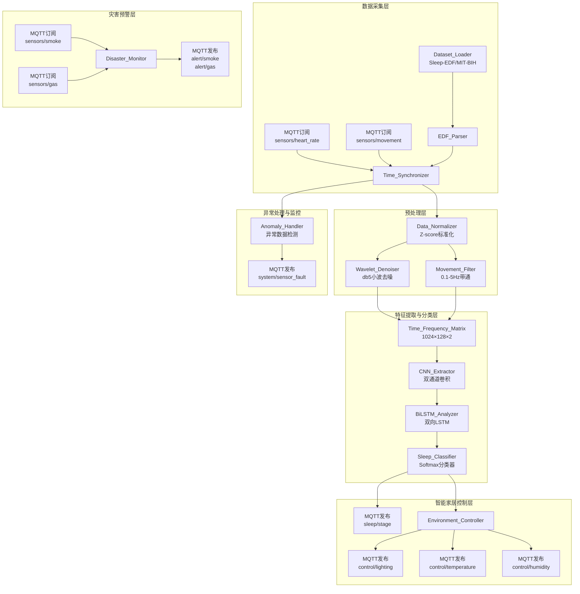
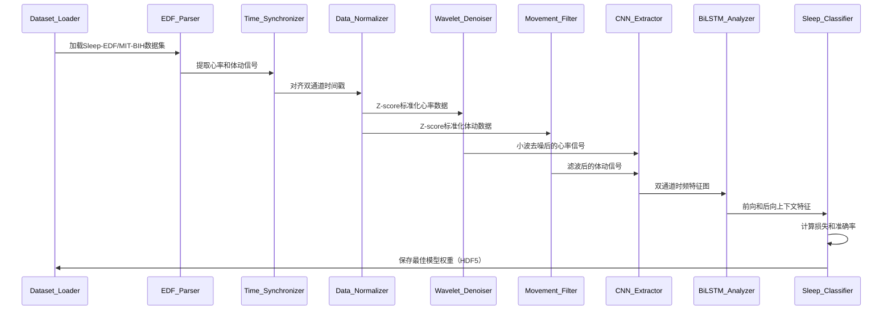
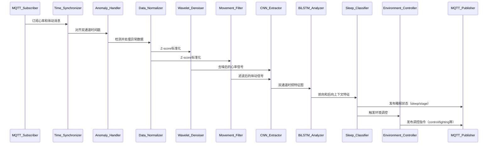

# 设计文档

## 概述

CNN-BiLSTM个性化睡眠算法模块是一个基于深度学习的睡眠阶段分类系统，专为智能家居场景设计。该系统通过处理心率和体动双传感器数据，实时分析用户的睡眠状态，并通过MQTT协议与智能家居设备通信，实现环境智能调控和灾害预警功能。

### 核心功能

1. **双传感器数据采集与同步**: 实时采集心率（100Hz）和体动（100Hz）传感器数据，通过时钟同步器确保双通道数据在时间轴上精确对齐（误差<5ms）
2. **信号预处理管道**: 包括Z-score标准化、小波去噪（db5小波基）和可选的体动信号滤波（0.1-5Hz带通）
3. **深度学习分类**: 采用CNN-BiLSTM混合架构提取时频特征并捕捉长短期时间依赖关系，输出四类睡眠阶段（清醒、浅睡、深睡、REM）
4. **MQTT智能家居集成**: 订阅传感器数据主题，发布睡眠状态和环境调控指令，支持灾害预警（烟雾、燃气）
5. **模型训练与验证**: 使用Sleep-EDF和MIT-BIH公开数据集进行训练，支持K折交叉验证和早停机制

### 技术栈

- **深度学习框架**: TensorFlow/Keras或PyTorch
- **信号处理**: PyWavelets（小波变换）、SciPy（滤波器设计）
- **数据格式**: EDF（European Data Format）文件解析
- **通信协议**: MQTT（Paho MQTT客户端）
- **数据存储**: HDF5（模型权重持久化）、JSON（配置和评估指标）

### 设计原则

1. **模块化架构**: 数据加载、预处理、特征提取、分类和MQTT通信各模块独立，便于测试和维护
2. **可配置性**: 所有关键参数（小波基类型、滤波器截止频率、CNN卷积核数量、BiLSTM隐藏层单元数）通过配置文件管理
3. **实时性**: MQTT消息发布延迟<500ms，灾害预警响应时间<100ms
4. **鲁棒性**: 异常数据检测与插值填充，传感器断连故障上报
5. **可追溯性**: 完整的日志记录和性能评估指标（准确率、精确率、召回率、F1分数、混淆矩阵）

## 架构

### 系统架构图




### 架构层次说明

#### 1. 数据采集层
- **Dataset_Loader**: 加载Sleep-EDF和MIT-BIH公开数据集，提取心率和体动信号通道
- **EDF_Parser**: 解析EDF格式文件，提取信号数据、采样率、物理单位和睡眠阶段标注
- **MQTT订阅器**: 实时订阅心率和体动传感器的MQTT消息（QoS 1）

#### 2. 预处理层
- **Time_Synchronizer**: 对齐心率和体动传感器的时间戳，使用线性插值确保时间偏移<5ms
- **Data_Normalizer**: 使用Z-score算法将双通道数据标准化到[-1,1]区间
- **Wavelet_Denoiser**: 使用db5小波基对心率信号进行多层分解和阈值去噪，抑制50Hz工频干扰
- **Movement_Filter**: 可选的体动信号低通滤波器（截止频率10Hz），保留0.1-5Hz睡眠相关频段

#### 3. 特征提取与分类层
- **Time_Frequency_Matrix**: 构建双通道时频矩阵（1024×128×2），输入到CNN
- **CNN_Extractor**: 双通道卷积神经网络，通过两层3×3卷积核和2×2最大池化提取局部特征
- **BiLSTM_Analyzer**: 双向长短期记忆网络，捕捉前向和后向时间依赖关系（记忆窗口30分钟）
- **Sleep_Classifier**: 全连接层+Softmax分类器，输出四类睡眠阶段概率分布和置信度

#### 4. 智能家居控制层
- **MQTT_Publisher**: 发布睡眠状态到主题"sleep/stage"（QoS 1）
- **Environment_Controller**: 根据睡眠阶段生成环境调控指令（光照、温度、湿度）

#### 5. 灾害预警层
- **Disaster_Monitor**: 监控烟雾和燃气传感器，超过安全阈值时发布预警消息（QoS 2）

#### 6. 异常处理与监控
- **Anomaly_Handler**: 检测心率和体动数据异常（范围检查、变化率检查），使用插值填充或上报传感器故障

## 组件和接口

### 核心组件

#### 1. Dataset_Loader（数据集加载器）

**职责**: 加载公开数据集并提取双传感器数据

**接口**:
```python
class DatasetLoader:
    def load_sleep_edf(self, dataset_path: str) -> Tuple[HeartRateData, MovementData, SleepStages]:
        """加载Sleep-EDF数据集"""
        pass
    
    def load_mit_bih(self, dataset_path: str) -> Tuple[HeartRateData, MovementData, SleepStages]:
        """加载MIT-BIH Polysomnographic数据集"""
        pass
    
    def split_train_test(self, data: Dataset, test_ratio: float = 0.2) -> Tuple[TrainingSet, TestSet]:
        """按受试者ID划分训练集和测试集"""
        pass
    
    def k_fold_split(self, data: Dataset, k: int = 5) -> List[Tuple[TrainingSet, TestSet]]:
        """K折交叉验证数据划分"""
        pass
```

**依赖**: EDF_Parser

#### 2. EDF_Parser（EDF文件解析器）

**职责**: 解析EDF格式的睡眠数据文件

**接口**:
```python
class EDFParser:
    def parse_header(self, edf_file_path: str) -> EDFHeader:
        """读取EDF文件头信息（采样率、物理单位、通道信息）"""
        pass
    
    def extract_heart_rate_channel(self, edf_file: EDFFile) -> HeartRateData:
        """提取心率信号通道"""
        pass
    
    def extract_movement_channel(self, edf_file: EDFFile) -> MovementData:
        """提取体动信号通道（加速度计数据）"""
        pass
    
    def extract_sleep_annotations(self, edf_file: EDFFile) -> SleepStages:
        """提取睡眠阶段标注"""
        pass
```

#### 3. Time_Synchronizer（时钟同步器）

**职责**: 同步心率和体动传感器的时间戳

**接口**:
```python
class TimeSynchronizer:
    def calculate_time_offset(self, hr_timestamps: np.ndarray, mv_timestamps: np.ndarray) -> float:
        """计算两个传感器的时间偏移量"""
        pass
    
    def align_data(self, hr_data: HeartRateData, mv_data: MovementData) -> Tuple[HeartRateData, MovementData]:
        """使用线性插值对齐双通道数据，确保时间戳差<5ms"""
        pass
```

**约束**: 
- 时间偏移量>1秒时记录警告日志
- 对齐后的数据长度等于两个传感器数据长度的最小值

#### 4. Data_Normalizer（数据标准化处理器）

**职责**: 使用Z-score算法标准化双通道数据

**接口**:
```python
class DataNormalizer:
    def fit(self, training_data: TrainingSet) -> None:
        """基于训练集计算心率和体动的均值和标准差参数"""
        pass
    
    def transform(self, data: Dataset) -> Dataset:
        """使用训练集参数对数据进行Z-score标准化"""
        pass
    
    def fit_transform(self, training_data: TrainingSet) -> TrainingSet:
        """拟合并转换训练集"""
        pass
```

**约束**: 标准化后的训练集均值≈0，标准差≈1

#### 5. Wavelet_Denoiser（小波去噪处理器）

**职责**: 去除心率信号中的工频干扰和噪声

**接口**:
```python
class WaveletDenoiser:
    def __init__(self, wavelet: str = 'db5', level: int = 5):
        """初始化小波去噪器，默认使用db5小波基"""
        pass
    
    def denoise(self, heart_rate_signal: np.ndarray) -> np.ndarray:
        """多层小波分解、阈值处理和信号重构"""
        pass
```

**约束**: 去噪后50Hz频段能量<去噪前该频段能量的10%

#### 6. Movement_Filter（体动信号滤波器）

**职责**: 对体动信号进行滤波处理

**接口**:
```python
class MovementFilter:
    def __init__(self, enabled: bool = True, cutoff_freq: float = 10.0):
        """初始化滤波器，默认截止频率10Hz"""
        pass
    
    def filter(self, movement_signal: np.ndarray) -> np.ndarray:
        """应用低通滤波器，保留0.1-5Hz频段"""
        pass
```

**约束**: 滤波后高频噪声能量<滤波前的20%

#### 7. CNN_Extractor（卷积神经网络特征提取器）

**职责**: 从双通道时频矩阵中提取睡眠相关特征

**接口**:
```python
class CNNExtractor:
    def __init__(self, input_shape: Tuple[int, int, int] = (1024, 128, 2)):
        """初始化CNN，输入维度为1024×128×2（时间×频率×双通道）"""
        pass
    
    def extract_features(self, time_frequency_matrix: np.ndarray) -> np.ndarray:
        """通过两层3×3卷积和2×2最大池化提取特征图"""
        pass
```

**约束**: 
- 输入维度必须为1024×128×2
- 从心率通道突出0.1-0.4Hz频段的HRV特征
- 从体动通道突出0.1-5Hz频段的体动特征

#### 8. BiLSTM_Analyzer（双向长短期记忆网络分析器）

**职责**: 捕捉心率和体动信号的长短期时间依赖关系

**接口**:
```python
class BiLSTMAnalyzer:
    def __init__(self, hidden_units: int = 128, memory_window: int = 1800):
        """初始化BiLSTM，记忆窗口30分钟（1800秒）"""
        pass
    
    def analyze(self, cnn_features: np.ndarray) -> np.ndarray:
        """处理前向和后向时间序列，输出包含双向上下文的特征向量"""
        pass
```

#### 9. Sleep_Classifier（睡眠阶段分类器）

**职责**: 基于BiLSTM特征向量对睡眠状态进行分类

**接口**:
```python
class SleepClassifier:
    def __init__(self, num_classes: int = 4):
        """初始化分类器，默认四类睡眠阶段（清醒、浅睡、深睡、REM）"""
        pass
    
    def classify(self, bilstm_features: np.ndarray) -> Tuple[SleepStage, float]:
        """输出睡眠阶段预测结果和分类置信度"""
        pass
    
    def get_probability_distribution(self, bilstm_features: np.ndarray) -> np.ndarray:
        """输出所有类别的概率分布（和为1）"""
        pass
```

**约束**: 
- 分类置信度∈[0,1]
- 所有类别概率之和=1

#### 10. MQTT_Subscriber（MQTT消息订阅器）

**职责**: 订阅传感器和灾害监控的MQTT消息

**接口**:
```python
class MQTTSubscriber:
    def subscribe_heart_rate(self, topic: str = "sensors/heart_rate") -> None:
        """订阅心率传感器主题"""
        pass
    
    def subscribe_movement(self, topic: str = "sensors/movement") -> None:
        """订阅体动传感器主题"""
        pass
    
    def subscribe_smoke(self, topic: str = "sensors/smoke") -> None:
        """订阅烟雾传感器主题"""
        pass
    
    def subscribe_gas(self, topic: str = "sensors/gas") -> None:
        """订阅燃气传感器主题"""
        pass
    
    def on_message(self, topic: str, payload: str) -> None:
        """消息回调函数，解析JSON格式消息体并验证有效性"""
        pass
```

**约束**: 
- 消息时间戳>5秒时丢弃消息
- 心率值∈[30,200]bpm
- 超出范围的数据标记为异常

#### 11. MQTT_Publisher（MQTT消息发布器）

**职责**: 发布睡眠状态、环境调控指令和预警消息

**接口**:
```python
class MQTTPublisher:
    def publish_sleep_stage(self, stage: SleepStage, confidence: float, qos: int = 1) -> None:
        """发布睡眠状态到主题"sleep/stage"，QoS级别1"""
        pass
    
    def publish_environment_control(self, control_type: str, target_value: float, priority: int, qos: int = 1) -> None:
        """发布环境调控指令（光照/温度/湿度），QoS级别1"""
        pass
    
    def publish_disaster_alert(self, alert_type: str, sensor_location: str, concentration: float, qos: int = 2) -> None:
        """发布灾害预警消息，QoS级别2"""
        pass
```

**约束**: 
- 睡眠状态消息发布延迟<500ms
- 灾害预警消息发布延迟<100ms
- 所有消息符合预定义的JSON schema

#### 12. Environment_Controller（环境调控指令生成器）

**职责**: 根据睡眠阶段生成环境调控指令

**接口**:
```python
class EnvironmentController:
    def generate_lighting_control(self, sleep_stage: SleepStage) -> Dict:
        """生成光照调控指令"""
        pass
    
    def generate_temperature_control(self, sleep_stage: SleepStage) -> Dict:
        """生成温度调控指令"""
        pass
    
    def generate_humidity_control(self, sleep_stage: SleepStage) -> Dict:
        """生成湿度调控指令"""
        pass
```

**调控策略**:
- 深睡阶段: 关闭光照，温度18-20°C，湿度50-60%
- 清醒阶段: 唤醒模式（逐渐增加光照亮度）

#### 13. Disaster_Monitor（灾害预警监控器）

**职责**: 监控烟雾和燃气传感器并发布预警

**接口**:
```python
class DisasterMonitor:
    def __init__(self, smoke_threshold: float, gas_threshold: float):
        """初始化灾害监控器，设置安全阈值"""
        pass
    
    def check_smoke_level(self, smoke_concentration: float) -> bool:
        """检查烟雾浓度是否超过安全阈值"""
        pass
    
    def check_gas_level(self, gas_concentration: float) -> bool:
        """检查燃气浓度是否超过安全阈值"""
        pass
```

### 数据流

#### 训练阶段数据流



#### 实时推理阶段数据流



## 数据模型

### 核心数据结构

#### 1. HeartRateData（心率数据）

```python
@dataclass
class HeartRateData:
    timestamps: np.ndarray  # 时间戳数组（Unix时间戳，单位：秒）
    values: np.ndarray      # 心率值数组（单位：bpm）
    sampling_rate: int      # 采样率（默认100Hz）
    
    def __post_init__(self):
        assert len(self.timestamps) == len(self.values)
        assert self.sampling_rate > 0
        assert np.all((self.values >= 30) & (self.values <= 200))  # 有效范围检查
```

#### 2. MovementData（体动数据）

```python
@dataclass
class MovementData:
    timestamps: np.ndarray  # 时间戳数组（Unix时间戳，单位：秒）
    values: np.ndarray      # 体动幅度数组（加速度计数据）
    sampling_rate: int      # 采样率（默认100Hz）
    
    def __post_init__(self):
        assert len(self.timestamps) == len(self.values)
        assert self.sampling_rate > 0
```

#### 3. SleepStage（睡眠阶段）

```python
from enum import Enum

class SleepStage(Enum):
    AWAKE = 0      # 清醒
    LIGHT = 1      # 浅睡
    DEEP = 2       # 深睡
    REM = 3        # 快速眼动睡眠
```

#### 4. SleepStages（睡眠阶段标注序列）

```python
@dataclass
class SleepStages:
    timestamps: np.ndarray  # 时间戳数组
    stages: np.ndarray      # 睡眠阶段数组（SleepStage枚举值）
    
    def __post_init__(self):
        assert len(self.timestamps) == len(self.stages)
        assert np.all(np.isin(self.stages, [0, 1, 2, 3]))  # 有效阶段检查
```

#### 5. EDFHeader（EDF文件头信息）

```python
@dataclass
class EDFHeader:
    subject_id: str                    # 受试者ID
    recording_date: datetime           # 记录日期
    duration_seconds: float            # 记录时长（秒）
    num_channels: int                  # 通道数量
    channel_labels: List[str]          # 通道标签列表
    sampling_rates: Dict[str, int]     # 各通道采样率
    physical_units: Dict[str, str]     # 各通道物理单位
```

#### 6. TimeFrequencyMatrix（时频矩阵）

```python
@dataclass
class TimeFrequencyMatrix:
    matrix: np.ndarray  # 维度为(1024, 128, 2)，时间×频率×双通道
    
    def __post_init__(self):
        assert self.matrix.shape == (1024, 128, 2)
```

#### 7. Dataset（数据集）

```python
@dataclass
class Dataset:
    heart_rate: HeartRateData
    movement: MovementData
    sleep_stages: SleepStages
    subject_ids: List[str]  # 受试者ID列表
    
    def __post_init__(self):
        assert len(self.heart_rate.timestamps) == len(self.movement.timestamps)
        assert len(self.heart_rate.timestamps) == len(self.sleep_stages.timestamps)
```

#### 8. TrainingSet和TestSet（训练集和测试集）

```python
@dataclass
class TrainingSet:
    dataset: Dataset
    normalization_params: Dict[str, Tuple[float, float]]  # {'heart_rate': (mean, std), 'movement': (mean, std)}

@dataclass
class TestSet:
    dataset: Dataset
```

#### 9. MQTTMessage（MQTT消息）

```python
@dataclass
class MQTTMessage:
    topic: str
    payload: Dict  # JSON格式消息体
    timestamp: float
    qos: int  # QoS级别（0, 1, 2）
```

**心率传感器消息格式**:
```json
{
  "device_id": "hr_sensor_001",
  "timestamp": 1678901234.567,
  "heart_rate": 72.5
}
```

**体动传感器消息格式**:
```json
{
  "device_id": "mv_sensor_001",
  "timestamp": 1678901234.567,
  "movement_amplitude": 0.15
}
```

**睡眠状态消息格式**:
```json
{
  "device_id": "sleep_monitor_001",
  "timestamp": 1678901234.567,
  "sleep_stage": "DEEP",
  "confidence": 0.92
}
```

**环境调控指令消息格式**:
```json
{
  "control_type": "lighting",
  "target_value": 0.0,
  "priority": 1,
  "timestamp": 1678901234.567
}
```

**灾害预警消息格式**:
```json
{
  "alert_type": "smoke",
  "sensor_location": "bedroom",
  "concentration": 150.0,
  "threshold": 100.0,
  "timestamp": 1678901234.567
}
```

#### 10. ModelWeights（模型权重）

```python
@dataclass
class ModelWeights:
    cnn_weights: np.ndarray
    bilstm_weights: np.ndarray
    classifier_weights: np.ndarray
    file_path: str  # HDF5文件路径
```

#### 11. PerformanceMetrics（性能评估指标）

```python
@dataclass
class PerformanceMetrics:
    accuracy: float                          # 总体准确率
    precision_per_class: Dict[SleepStage, float]  # 每个类别的精确率
    recall_per_class: Dict[SleepStage, float]     # 每个类别的召回率
    f1_per_class: Dict[SleepStage, float]         # 每个类别的F1分数
    confusion_matrix: np.ndarray             # 混淆矩阵（4×4）
    
    def __post_init__(self):
        assert 0.0 <= self.accuracy <= 1.0
        for metric in [self.precision_per_class, self.recall_per_class, self.f1_per_class]:
            for value in metric.values():
                assert 0.0 <= value <= 1.0
```

### 配置文件格式

**config.json**:
```json
{
  "data_processing": {
    "normalization": {
      "method": "z-score"
    },
    "wavelet_denoising": {
      "wavelet_type": "db5",
      "decomposition_level": 5
    },
    "movement_filter": {
      "enabled": true,
      "cutoff_frequency": 10.0
    }
  },
  "model": {
    "cnn": {
      "num_conv_layers": 2,
      "kernel_size": [3, 3],
      "num_filters": [32, 64],
      "pool_size": [2, 2]
    },
    "bilstm": {
      "hidden_units": 128,
      "memory_window_seconds": 1800
    },
    "classifier": {
      "num_classes": 4
    }
  },
  "mqtt": {
    "broker_address": "localhost",
    "broker_port": 1883,
    "topics": {
      "heart_rate": "sensors/heart_rate",
      "movement": "sensors/movement",
      "sleep_stage": "sleep/stage",
      "lighting_control": "control/lighting",
      "temperature_control": "control/temperature",
      "humidity_control": "control/humidity",
      "smoke_sensor": "sensors/smoke",
      "gas_sensor": "sensors/gas",
      "smoke_alert": "alert/smoke",
      "gas_alert": "alert/gas",
      "sensor_fault": "system/sensor_fault"
    }
  },
  "disaster_monitoring": {
    "smoke_threshold": 100.0,
    "gas_threshold": 50.0
  },
  "training": {
    "batch_size": 32,
    "epochs": 100,
    "learning_rate": 0.001,
    "early_stopping_patience": 5,
    "k_fold": 5
  }
}
```


## 正确性属性

*属性是指在系统所有有效执行中都应保持为真的特征或行为——本质上是关于系统应该做什么的形式化陈述。属性是人类可读规范和机器可验证正确性保证之间的桥梁。*

### 属性反思

在编写正确性属性之前，我对预分析中识别的属性进行了冗余性审查:

**冗余分析**:
1. 需求2的属性2.9和2.10测试相同的数学不变量（数据长度=记录时长×采样率），可以合并为一个综合属性
2. 需求5的属性5.5和5.6测试相同的标准化范围约束，可以合并
3. 需求5的属性5.7和5.8测试相同的Z-score标准化核心属性，可以合并
4. 需求12、13、14的属性都测试JSON schema符合性，可以合并为一个综合的消息格式验证属性

**保留的独立属性**:
- 需求1.9: 数据集加载完整性
- 需求3.7和3.8: 时钟同步的两个不同方面（时间戳精度和数据长度）
- 需求4.6: K折划分均衡性
- 需求6.5: 小波去噪效果
- 需求7.6: 滤波器效果
- 需求8.9: CNN降维比例
- 需求9.6: BiLSTM输出维度
- 需求10.5和10.6: 分类器的两个不同约束（置信度范围和概率和）
- 需求17.7: 模型持久化往返属性
- 需求18.9: 插值填充范围约束
- 需求19.7: 评估指标范围约束

### 属性1: 数据集加载完整性

*对于任意*支持的数据集（Sleep-EDF或MIT-BIH），加载后的数据应包含心率信号、体动信号和睡眠阶段标注三个必需组件。

**验证需求: 1.9**

### 属性2: EDF解析数据长度一致性

*对于任意*有效的EDF文件，解析后的心率数据长度和体动数据长度都应等于（记录时长×采样率）。

**验证需求: 2.9, 2.10**

### 属性3: 时钟同步时间戳精度

*对于任意*对齐后的双传感器数据对，心率和体动数据的时间戳差应小于5ms。

**验证需求: 3.7**

### 属性4: 时钟同步数据长度不变量

*对于任意*双传感器对齐操作，对齐后的数据长度应等于两个传感器数据长度的最小值。

**验证需求: 3.8**

### 属性5: K折划分均衡性

*对于任意*K折交叉验证划分，每个子集应包含大致相等数量的样本（样本数量差异在±10%范围内）。

**验证需求: 4.6**

### 属性6: Z-score标准化范围约束

*对于任意*双通道数据（心率和体动），Z-score标准化后的值应在合理范围内（99.7%的数据在[-3,3]区间内）。

**验证需求: 5.5, 5.6**

### 属性7: Z-score标准化统计特性

*对于任意*训练集的双通道数据（心率和体动），Z-score标准化后的均值应接近0（|mean|<0.01）且标准差应接近1（|std-1|<0.01）。

**验证需求: 5.7, 5.8**

### 属性8: 小波去噪工频抑制效果

*对于任意*包含50Hz工频干扰的心率信号，小波去噪后50Hz频段的能量应低于去噪前该频段能量的10%。

**验证需求: 6.5**

### 属性9: 体动滤波高频抑制效果

*对于任意*包含高频噪声（>10Hz）的体动信号，滤波后高频噪声能量应低于滤波前的20%。

**验证需求: 7.6**

### 属性10: CNN特征提取降维一致性

*对于任意*维度为1024×128×2的输入矩阵，经过两层3×3卷积和2×2最大池化后，输出特征图的维度应符合预期的降维比例（256×32×num_filters）。

**验证需求: 8.9**

### 属性11: BiLSTM输出维度双向性

*对于任意*时间序列输入，BiLSTM输出向量的维度应为2×hidden_units（包含前向和后向上下文信息）。

**验证需求: 9.6**

### 属性12: 分类置信度范围约束

*对于任意*有效的BiLSTM特征向量，睡眠阶段分类器输出的置信度应在[0,1]区间内。

**验证需求: 10.5**

### 属性13: Softmax概率归一化

*对于任意*有效的BiLSTM特征向量，睡眠阶段分类器输出的所有类别概率之和应等于1（允许浮点误差|sum-1|<1e-6）。

**验证需求: 10.6**

### 属性14: MQTT消息格式符合性

*对于任意*发布的MQTT消息（睡眠状态、环境调控指令、灾害预警），消息格式应符合预定义的JSON schema（包含所有必需字段且类型正确）。

**验证需求: 12.6, 13.7, 14.8**

### 属性15: 模型持久化往返一致性

*对于任意*训练好的模型和输入数据，保存模型后加载，加载后的模型输出应与保存前的模型输出一致（允许浮点误差<1e-6）。

**验证需求: 17.7**

### 属性16: 插值填充范围约束

*对于任意*包含异常数据的序列，插值填充后的值应在相邻有效数据的[min, max]范围内。

**验证需求: 18.9**

### 属性17: 评估指标范围约束

*对于任意*预测结果和真实标签，计算的评估指标（准确率、精确率、召回率、F1分数）应在[0,1]区间内。

**验证需求: 19.7**

## 错误处理

### 错误类型和处理策略

#### 1. 数据加载错误

**错误场景**:
- 数据集路径无效
- EDF文件格式损坏
- 数据集缺少心率或体动通道

**处理策略**:
- 返回明确的错误信息（包含错误类型和原因）
- 记录错误日志（包含时间戳、文件路径、错误详情）
- 不进行任何数据处理，保持系统状态不变

**错误消息示例**:
```python
class DatasetLoadError(Exception):
    """数据集加载错误"""
    pass

class EDFParseError(Exception):
    """EDF文件解析错误"""
    pass

# 使用示例
try:
    dataset = loader.load_sleep_edf(invalid_path)
except DatasetLoadError as e:
    logger.error(f"数据集加载失败: {e}")
    # 返回错误响应，不继续处理
```

#### 2. 时钟同步错误

**错误场景**:
- 时间偏移量超过1秒

**处理策略**:
- 记录警告日志（包含时间偏移量、传感器ID）
- 标记数据为不可靠（添加"unreliable"标志）
- 继续处理但在后续分析中考虑数据可靠性

**警告日志示例**:
```python
if time_offset > 1.0:
    logger.warning(f"时间偏移量过大: {time_offset}秒, 传感器: {sensor_id}")
    data.metadata['reliable'] = False
```

#### 3. 传感器数据异常

**错误场景**:
- 心率值超出[30,200]bpm范围
- 心率变化率超过50bpm/秒
- 体动数据超出合理幅度范围
- 消息时间戳超过5秒（数据过时）

**处理策略**:
- 标记异常数据点（添加"anomaly"标志）
- 连续5秒异常数据时使用线性插值填充
- 记录异常事件到日志系统
- 传感器断连时发布故障消息到MQTT主题"system/sensor_fault"

**异常处理示例**:
```python
def detect_heart_rate_anomaly(hr_value: float, prev_hr_value: float, time_delta: float) -> bool:
    """检测心率异常"""
    if not (30 <= hr_value <= 200):
        return True
    if abs(hr_value - prev_hr_value) / time_delta > 50:
        return True
    return False

def interpolate_anomalous_data(data: np.ndarray, anomaly_mask: np.ndarray) -> np.ndarray:
    """使用线性插值填充异常数据"""
    valid_indices = np.where(~anomaly_mask)[0]
    anomalous_indices = np.where(anomaly_mask)[0]
    interpolated_values = np.interp(anomalous_indices, valid_indices, data[valid_indices])
    data[anomalous_indices] = interpolated_values
    return data
```

#### 4. 模型输入验证错误

**错误场景**:
- CNN输入维度不是1024×128×2
- BiLSTM输入特征向量维度不匹配

**处理策略**:
- 在模型输入前进行维度验证
- 返回明确的错误信息（包含期望维度和实际维度）
- 不执行模型推理，避免产生无效结果

**验证示例**:
```python
def validate_cnn_input(input_matrix: np.ndarray) -> None:
    """验证CNN输入维度"""
    expected_shape = (1024, 128, 2)
    if input_matrix.shape != expected_shape:
        raise ValueError(
            f"CNN输入维度错误: 期望{expected_shape}, 实际{input_matrix.shape}"
        )
```

#### 5. MQTT通信错误

**错误场景**:
- MQTT broker连接失败
- 消息发布超时
- 消息格式不符合JSON schema

**处理策略**:
- 实现自动重连机制（指数退避策略）
- 消息发布失败时重试3次
- 记录通信错误日志
- 消息格式错误时拒绝发布并记录错误

**重连机制示例**:
```python
def connect_with_retry(broker_address: str, max_retries: int = 5) -> None:
    """带重试的MQTT连接"""
    retry_delay = 1.0
    for attempt in range(max_retries):
        try:
            client.connect(broker_address)
            logger.info("MQTT连接成功")
            return
        except Exception as e:
            logger.warning(f"MQTT连接失败 (尝试{attempt+1}/{max_retries}): {e}")
            time.sleep(retry_delay)
            retry_delay *= 2  # 指数退避
    raise ConnectionError("MQTT连接失败，已达最大重试次数")
```

#### 6. 模型加载错误

**错误场景**:
- 模型文件不存在
- 模型文件损坏
- 模型版本不兼容

**处理策略**:
- 系统启动时验证模型文件存在性和完整性
- 模型文件错误时拒绝启动系统
- 返回明确的错误信息并记录日志
- 建议用户检查模型文件路径或重新训练模型

**模型加载验证示例**:
```python
def load_model_with_validation(model_path: str) -> ModelWeights:
    """加载并验证模型文件"""
    if not os.path.exists(model_path):
        raise FileNotFoundError(f"模型文件不存在: {model_path}")
    
    try:
        model_weights = load_hdf5(model_path)
        validate_model_structure(model_weights)
        return model_weights
    except Exception as e:
        raise RuntimeError(f"模型文件损坏或版本不兼容: {e}")
```

#### 7. 配置文件错误

**错误场景**:
- 配置文件不存在
- 配置参数无效（例如负数的卷积核数量）
- 配置文件JSON格式错误

**处理策略**:
- 配置文件错误时使用默认配置
- 记录错误日志并警告用户
- 验证所有配置参数的有效性（范围检查、类型检查）

**配置验证示例**:
```python
def load_config_with_defaults(config_path: str) -> Dict:
    """加载配置文件，错误时使用默认配置"""
    try:
        with open(config_path, 'r') as f:
            config = json.load(f)
        validate_config(config)
        return config
    except Exception as e:
        logger.error(f"配置文件加载失败，使用默认配置: {e}")
        return get_default_config()

def validate_config(config: Dict) -> None:
    """验证配置参数有效性"""
    if config['model']['cnn']['num_filters'][0] <= 0:
        raise ValueError("CNN滤波器数量必须为正数")
    if config['model']['bilstm']['hidden_units'] <= 0:
        raise ValueError("BiLSTM隐藏层单元数必须为正数")
```

### 错误恢复机制

#### 1. 数据异常恢复
- 短期异常（<5秒）: 使用线性插值填充
- 长期异常（≥5秒）: 标记数据段为不可靠，跳过该时间段的分析

#### 2. 传感器故障恢复
- 单传感器故障: 发布故障消息，尝试使用单通道数据进行降级分析
- 双传感器故障: 停止睡眠分析，仅保持灾害预警功能

#### 3. MQTT通信恢复
- 连接断开: 自动重连（指数退避策略）
- 消息积压: 优先发送灾害预警消息（QoS 2），其次是睡眠状态消息（QoS 1）

## 测试策略

### 测试方法概述

本系统采用**双重测试方法**，结合单元测试和基于属性的测试（Property-Based Testing, PBT）:

1. **单元测试**: 验证特定示例、边界条件和错误场景
2. **基于属性的测试**: 验证跨所有输入的通用属性，通过随机生成大量测试用例发现边界情况

### 基于属性的测试配置

**测试库选择**: Python的`Hypothesis`库

**测试配置**:
- 每个属性测试最少运行100次迭代（由于随机化）
- 每个属性测试必须引用设计文档中的属性编号
- 标签格式: `# Feature: cnn-bilstm-sleep-algorithm, Property {number}: {property_text}`

**示例**:
```python
from hypothesis import given, strategies as st
import numpy as np

# Feature: cnn-bilstm-sleep-algorithm, Property 2: EDF解析数据长度一致性
@given(
    duration=st.floats(min_value=60.0, max_value=28800.0),  # 1分钟到8小时
    sampling_rate=st.integers(min_value=50, max_value=500)
)
def test_edf_parsing_data_length_consistency(duration, sampling_rate):
    """
    对于任意有效的EDF文件，解析后的心率数据长度和体动数据长度
    都应等于（记录时长×采样率）
    """
    edf_file = generate_mock_edf(duration, sampling_rate)
    parser = EDFParser()
    hr_data = parser.extract_heart_rate_channel(edf_file)
    mv_data = parser.extract_movement_channel(edf_file)
    
    expected_length = int(duration * sampling_rate)
    assert len(hr_data.values) == expected_length
    assert len(mv_data.values) == expected_length
```

### 测试覆盖范围

#### 1. 数据加载和解析测试

**单元测试**:
- 加载Sleep-EDF数据集的特定示例
- 加载MIT-BIH数据集的特定示例
- EDF文件格式损坏的错误处理
- 数据集路径无效的错误处理

**属性测试**:
- 属性1: 数据集加载完整性
- 属性2: EDF解析数据长度一致性

#### 2. 时钟同步测试

**单元测试**:
- 时间偏移量为0的情况
- 时间偏移量为10ms的情况
- 时间偏移量超过1秒的警告日志

**属性测试**:
- 属性3: 时钟同步时间戳精度
- 属性4: 时钟同步数据长度不变量

#### 3. 数据预处理测试

**单元测试**:
- Z-score标准化的特定示例
- 小波去噪的特定示例（包含50Hz干扰）
- 体动滤波的特定示例（包含高频噪声）

**属性测试**:
- 属性6: Z-score标准化范围约束
- 属性7: Z-score标准化统计特性
- 属性8: 小波去噪工频抑制效果
- 属性9: 体动滤波高频抑制效果

#### 4. 模型推理测试

**单元测试**:
- CNN输入维度验证
- BiLSTM输出维度验证
- 分类器输出格式验证

**属性测试**:
- 属性10: CNN特征提取降维一致性
- 属性11: BiLSTM输出维度双向性
- 属性12: 分类置信度范围约束
- 属性13: Softmax概率归一化

#### 5. MQTT通信测试

**单元测试**:
- 订阅心率和体动传感器主题
- 发布睡眠状态消息
- 发布环境调控指令
- 发布灾害预警消息
- MQTT连接失败的重连机制

**属性测试**:
- 属性14: MQTT消息格式符合性

#### 6. 模型持久化测试

**单元测试**:
- 保存模型到HDF5文件
- 从HDF5文件加载模型
- 模型文件不存在的错误处理
- 模型文件损坏的错误处理

**属性测试**:
- 属性15: 模型持久化往返一致性

#### 7. 异常数据处理测试

**单元测试**:
- 心率值超出范围的检测
- 心率变化率过大的检测
- 体动值超出范围的检测
- 传感器断连的故障上报

**属性测试**:
- 属性16: 插值填充范围约束

#### 8. 性能评估测试

**单元测试**:
- 计算准确率的特定示例
- 计算精确率、召回率、F1分数的特定示例
- 生成混淆矩阵的特定示例

**属性测试**:
- 属性17: 评估指标范围约束

#### 9. K折交叉验证测试

**单元测试**:
- K=5的特定划分示例
- K=10的特定划分示例

**属性测试**:
- 属性5: K折划分均衡性

### 集成测试

**端到端测试场景**:
1. **完整训练流程**: 加载数据集 → 预处理 → 训练模型 → 评估性能 → 保存模型
2. **完整推理流程**: 加载模型 → 订阅MQTT传感器数据 → 预处理 → 模型推理 → 发布睡眠状态 → 发布环境调控指令
3. **灾害预警流程**: 订阅烟雾和燃气传感器 → 检测浓度超标 → 发布预警消息

**性能测试**:
- MQTT消息发布延迟<500ms
- 灾害预警响应时间<100ms
- 模型推理吞吐量（每秒处理的样本数）

### 测试数据生成策略

**Hypothesis策略示例**:
```python
# 生成心率数据
heart_rate_strategy = st.lists(
    st.floats(min_value=30.0, max_value=200.0),
    min_size=100,
    max_size=10000
)

# 生成体动数据
movement_strategy = st.lists(
    st.floats(min_value=0.0, max_value=10.0),
    min_size=100,
    max_size=10000
)

# 生成时间戳
timestamp_strategy = st.lists(
    st.floats(min_value=0.0, max_value=86400.0),
    min_size=100,
    max_size=10000
).map(lambda x: sorted(x))  # 确保时间戳递增

# 生成睡眠阶段
sleep_stage_strategy = st.sampled_from([0, 1, 2, 3])  # 清醒、浅睡、深睡、REM
```

### 持续集成

**CI/CD流程**:
1. 代码提交触发自动化测试
2. 运行所有单元测试和属性测试
3. 运行集成测试和性能测试
4. 生成测试覆盖率报告（目标: >90%）
5. 测试通过后自动部署到测试环境

**测试报告**:
- 测试通过率
- 代码覆盖率
- 属性测试发现的边界情况
- 性能测试结果（延迟、吞吐量）

