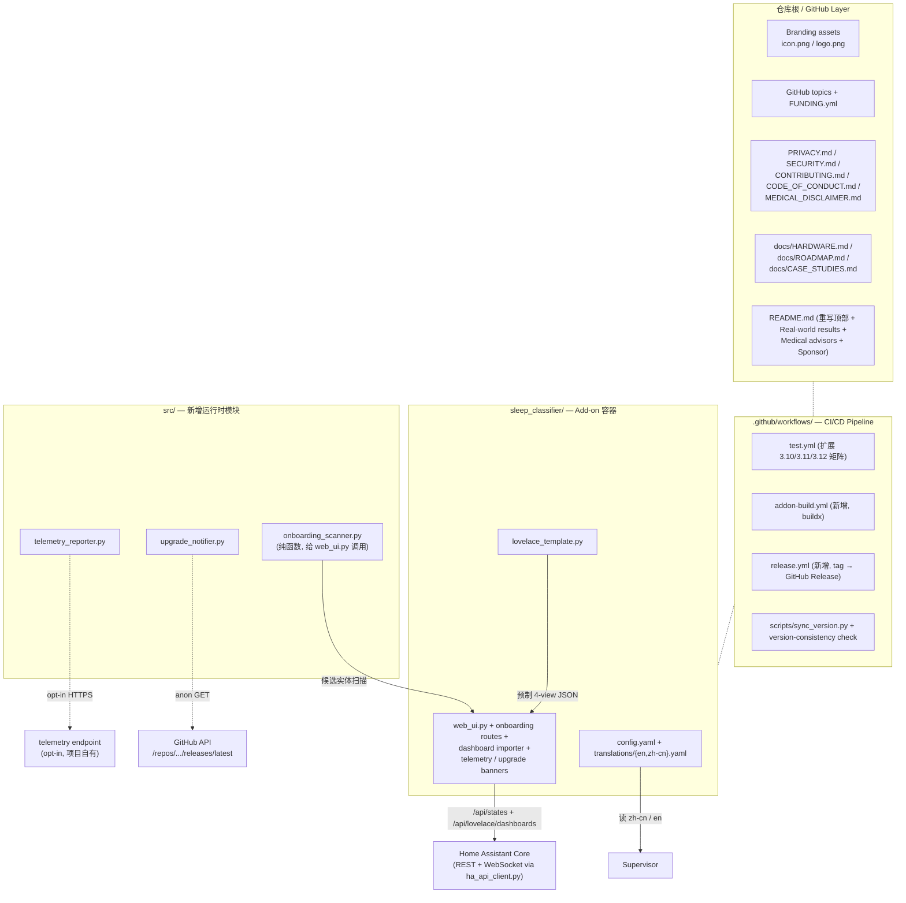
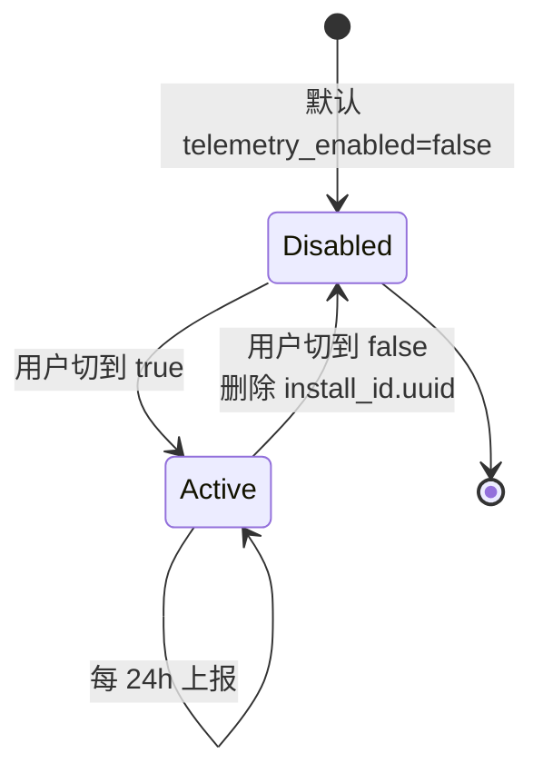
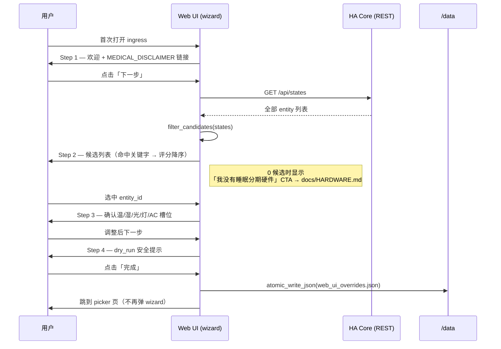

# Design Document

> Spec: commercial-readiness-v2.1.0
> Workflow: requirements-first（feature spec）
> 关联: `.kiro/specs/commercial-readiness-v2.1.0/requirements.md`、上一轮 bugfix `post-v2.0.2-full-pipeline-audit`

## Overview

v2.0.3 已经在「能不能装上、能不能不崩」两个层面合格了，但要进入「拿得到、留得住、可变现」的商业化阶段，还差 15 条品牌、合规、CI、可观测、引导、文档级别的工作。requirements.md 已经把这 15 条缺口形式化为 `CommercialReadinessState` 的不变量集合并按硬阻断 / 软阻断 / 增量优化分档。

本设计文档要解决的核心问题是：**在不破坏 v2.0.3 行为契约的前提下，把这 15 条差距收敛到一个 v2.1.0 可发布的最小变更集**。约束如下：

- **运行时依赖**：仍只允许 `aiohttp`，新模块（telemetry、upgrade-notifier、onboarding 后端、dashboard importer）一律以 stdlib + aiohttp 为底；Sentry/Glitchtip 走 `pip install sleep-classifier[telemetry]` 的可选 extra，默认不进镜像。
- **架构骨架**：`scripts/run_ha_smart_service.py` 仍是单一事件循环入口，新模块作为同事件循环里的 `asyncio.Task` 接入，遵守「绝不阻塞主循环」「HA 交互只走 `src/ha_api_client.py`」「`/data/*.json` 只走 `src/_io_utils.atomic_write_json`」三条 steering 硬规则。
- **持久化**：所有新增 JSON 字段全部 optional，缺失时回退安全默认值；不修改 v2.0.3 已有 schema。
- **范围切分**：第 12（设备生态）和第 13（多用户多房间）只交付 `docs/ROADMAP.md` + README FAQ 链接，留给 v2.2.0+；其它 13 条全部在本期实施。

设计上的最大权衡：v2.1.0 是一次「品牌 + 合规 + CI + onboarding」为主的商业化补完，工程量分布为 **大约 60% 文档与资产 + 25% Add-on UI / 后端薄层 + 15% CI/CD 流水线**；运行时核心模块（`preference_learner`、`smart_environment_controller`、`ha_api_client`）**不变**。这保证我们守住「537 测试 100% 过、覆盖率 ≥ 92% 不下降」的 PR1 不变量。

## Architecture

### 2.1 v2.0.3 既有架构（保留不动）

```
HA WebSocket (state_changed)             HA REST (/api/services/...)
       │                                            ▲
       ▼                                            │
ExternalStageSubscriber                             │
       │ SleepStage + debounced transitions        │
       ▼                                            │
SmartEnvironmentController ──► per-stage planner    │
       │                                            │
       ▼                                            │
PreferenceLearner ◄── /data/user_preferences.json   │
       │                                            │
       ▼                                            │
SleepStatePublisher / LearningPanelPublisher ───────┘
       (sensor.sleep_classifier_*  ×20)
```

### 2.2 v2.1.0 新增组件全景



关键点：

1. **新组件全部接入既有事件循环**。`telemetry_reporter` 与 `upgrade_notifier` 由 `scripts/run_ha_smart_service.py` 在启动时以 `asyncio.create_task()` 注册（与现有 `feedback_input` / `learning_panel_publisher` 同模式），主循环不感知它们的存在。
2. **网络出站全部归一化到 aiohttp**。telemetry → 项目自有 endpoint，upgrade-notifier → GitHub `/releases/latest`，dashboard importer → HA REST `/api/lovelace/dashboards`。三个出口都遵守同一份「opt-in / 静默退避 / 永不阻塞主循环」契约。
3. **`web_ui.py` 是唯一 UI 注入点**。Onboarding wizard、telemetry 开关、upgrade banner、dashboard importer 全部走现有 ingress 通道（`SUPERVISOR_TOKEN` + ingress IP allowlist），保持 v2.0.3 的相对路径契约不被破坏。
4. **GitHub layer 改动仅加文件，不改既有 src/**。除了三个新模块和 `lovelace_template.py`，`src/` 既有 18 个模块全部按 v2.0.3 状态冻结；这是 PR1 不变量的物理保证。

### 2.3 网络出口策略表

| 组件 | 触发条件 | 频率 | 失败处理 | 隐私契约 |
|---|---|---|---|---|
| `telemetry_reporter` | `telemetry_enabled = true`（默认 false） | 每 24 小时 1 次 | 指数退避，max 24h；不阻塞主循环 | payload 不含 entity_id / token / 数值偏好 |
| `upgrade_notifier` | `upgrade_notifications_enabled = true`（默认 true） | 每 24 小时 1 次 | 指数退避，max 24h；GitHub 403/404/5xx 静默 | 匿名 GET，不发 install_id |
| `web_ui.dashboard_importer` | 用户主动点击 | 单次 | 4xx/5xx 显式 toast + 「手动复制」回退 | 仅与 HA Core proxy 交互 |
| `web_ui.onboarding_scanner` | 用户首次打开 Web UI | 单次（缓存 60s） | HA 不可达时降级显示「我没有睡眠分期硬件」CTA | 仅读 `/api/states` |

### 2.4 不变量保护层（PR1–PR6）

每条 PR* 不变量在 design 中都要有显式守护点：

- **PR1 测试套件**：CI `test.yml` 矩阵 3.10/3.11/3.12，`fail-fast: false`；新增模块每个都要有镜像式 `tests/test_<module>.py`，覆盖率 ≥ 90%。
- **PR2 sensor 契约**：`SleepStatePublisher` / `LearningPanelPublisher` 不变；任何「新功能可能想发个新 sensor」一律走「追加新 sensor」而非改既有 sensor 语义。Telemetry / upgrade banner 都不发 sensor，只走 Web UI + persistent_notification。
- **PR3 持久化**：新文件 `/data/install_id.uuid`、`/data/last_upgrade_check.json` 全部 optional；读写一律走 `src._io_utils.atomic_write_json` 或 `atomic_write_text`。
- **PR4 运行时依赖**：`requirements-runtime.txt` 不动；`pyproject.toml` 增加 `[project.optional-dependencies]` 的 `telemetry` extra（包含 `sentry-sdk`），仅开发或自托管用户主动安装。
- **PR5 启动契约**：`run.sh` 不改 `tini -g` + `wait -n` 逻辑；新模块的 task 由 Python 主进程统一管理，SIGTERM 时由主进程在 ≤ 10 秒内 `cancel()` 并 `await asyncio.gather(..., return_exceptions=True)`。
- **PR6 配置 schema**：`config.yaml` 增加 `telemetry_enabled: false`、`upgrade_notifications_enabled: true`、`onboarding_skipped: false` 三个字段，全部带默认值且 schema 标 `?`。

## Components and Interfaces

### 3.1 Branding assets（Requirement 1）

**交付物**：

- `sleep_classifier/icon.png`：128×128 PNG，透明背景或与 HA 主色 `#03a9f4` 协调，主图为「半月 + 床」简笔。
- `sleep_classifier/logo.png`：250×100 PNG，左侧 icon + 右侧 wordmark。
- `assets/screenshots/`（仓库新目录）：≥ 1 张 Lovelace 4-view dashboard 截图（≥ 1200 px 宽）+ 1 段 demo GIF / 视频外链。
- GitHub 仓库 topics：`home-assistant`、`addon`、`sleep-tracking`、`smart-home`，由维护者在 GitHub 仓库设置中手动配置（CI 不能写 topics，只能在文档里登记）。

**接入点**：

- `prepare.sh` / `prepare.bat` 已经把 `sleep_classifier/` 目录原样作为 docker context；icon.png / logo.png 直接放在该目录下即可被 HA Supervisor 加载，**不需要进 `rootfs/`**（这是 P1.2 路径不变量的来源）。
- `addon-lint` 已存在的 GitHub action 会校验 icon 尺寸；本期新增 `scripts/check_branding.py`（CI 步骤），用 stdlib 的 `struct` 解析 PNG header 校验尺寸，不引入 Pillow 运行时依赖（CI 步骤可以装 Pillow，但 add-on 镜像一定不能装）。

**接口签名**（CI 用）：

```python
# scripts/check_branding.py
def assert_png_size(path: Path, expected: tuple[int, int]) -> None: ...
def main() -> int:  # 返回非零退出码即 CI 失败
    ...
```

### 3.2 Translations pack（Requirement 2）

**目录结构**：

```
sleep_classifier/translations/
├── en.yaml      # 与 config.yaml 的 options 一一对应
└── zh-cn.yaml
```

**文件 schema**（与 HA Supervisor 翻译规范对齐）：

```yaml
configuration:
  area:
    name: "目标区域"
    description: "留空扫描全部房间。例：bedroom"
  infer_interval:
    name: "推理间隔（秒）"
    description: "每 N 秒读一次 HA 状态做一次推理。"
  # ... 共 ≥ 30 个 key
network: {}    # add-on 没有暴露 network options，但保留键以便未来扩展
```

**覆盖率守护**：新增 `scripts/check_translations.py`，CI 步骤（`translations-coverage` job）解析三份 YAML，三集合相等性检查（P2.1）。任何 `config.yaml` 中 `options.*` 增删改名，未同步 `en.yaml` / `zh-cn.yaml` 即 CI 失败。

**回退安全性**（P2.2）由 HA Supervisor 自身保证（locale 缺失 → en；en 缺失 → 字面值）。我们在 CI 里不模拟 supervisor，只静态校验 key 集合相等。

### 3.3 Hardware recommendation page（Requirement 3）

**交付物**：

- `docs/HARDWARE.md`：3 类（毫米波雷达、智能手环、智能手表）共 ≥ 5 款硬件；表格列出型号、价格区间、HA 接入路径、典型 entity_id、4 阶段（AWAKE/LIGHT/DEEP/REM）支持度、是否经 ≥ 7 天 dry_run 真实验证。
- 顶部 affiliate disclosure 段（FTC + 中国《广告法》合规）。
- `README.md` 顶部增加「Hardware Required」section，中英双链文案：`No sleep-stage sensor? Start here.`。

**联动点**：

- Onboarding wizard 在「自动扫描」步骤返回 0 候选时，CTA 链接指向相对路径 `../docs/HARDWARE.md`（DOCS 由 HA UI 渲染时是绝对 GitHub URL，二者通过 `lovelace_template.py` 同源常量复用）。
- README 顶部「30 天你会看到什么」表格之前插入硬件 section，与 Requirement 1 的截图墙在同一 fold 内。

### 3.4 Release engineering（Requirement 4）

#### 3.4.1 工作流总览

| 工作流 | 触发 | 关键 job |
|---|---|---|
| `test.yml`（扩展） | push / PR → main | `pytest --cov` × Python {3.10, 3.11, 3.12}；`fail-fast: false`；coverage gate ≥ 92%；`addon-lint` |
| `addon-build.yml`（新增） | push → main | `prepare.sh` → `docker buildx build --platform linux/arm64,linux/amd64` |
| `release.yml`（新增） | tag `v[0-9]+.[0-9]+.[0-9]+` | `sync_version.py --check` → 抽 CHANGELOG 段落 → 创建 GitHub Release → 上传 `sleep_classifier/` zip |

#### 3.4.2 版本一致性

**Single Source of Truth**：`pyproject.toml` 的 `[project] version`。

**同步脚本**：

```python
# scripts/sync_version.py
def read_canonical() -> str: ...                      # 读 pyproject.toml
def sync(version: str, *, check_only: bool) -> int:   # 写 / 校验三处
    # 1. setup.py 的 version=
    # 2. sleep_classifier/config.yaml 的 version:
    # 3. src/__init__.py 的 __version__ (如存在则同步)
def main() -> int: ...
```

CLI：

- `python scripts/sync_version.py`：从 pyproject 写到其它三处。
- `python scripts/sync_version.py --check`：只校验，不写；不一致返回非零。

CI 在 `test.yml` 中 hook `--check`，`release.yml` 在打 tag 时 hook 写入并 commit `chore: sync version`（无须人工干预）。

#### 3.4.3 docker buildx 干净环境验证

`addon-build.yml` 步骤序列：

1. `actions/checkout`
2. `bash sleep_classifier/prepare.sh`（确保 `rootfs/` 与 `src/` 一致）
3. `git diff --exit-code sleep_classifier/rootfs/` —— 若 prepare 产出了未提交的 diff，立即 fail（与 v2.0.3 既有的 `prepare-up-to-date` 检查保留）
4. `docker/setup-buildx-action`
5. `docker buildx build --platform linux/arm64,linux/amd64 sleep_classifier/`（不 push）

#### 3.4.4 Release body 抽取

`release.yml` 用 `sed -n '/^## \['"$VERSION"'\]/,/^## \[/p' CHANGELOG.md | sed '$d'` 抽取对应版本段落，作为 release body 的 `body_path`。如果 CHANGELOG 中找不到对应版本，job 失败（避免发空 release）。

### 3.5 Legal document set（Requirement 5）

**清单**（仓库根目录）：

| 文件 | 主要内容 | 链接关系 |
|---|---|---|
| `PRIVACY.md` | 数据类型 / 存储位置 / 保留期限 / opt-in 遥测内容与撤回方式 | 被 README、DOCS.md、Web UI 配置页、telemetry 开关旁文案链接 |
| `SECURITY.md` | 漏洞披露邮箱、≤ 7 天首响、CVE 流程、禁止公开 issue | 被 README footer、advisors section（Requirement 14）链接 |
| `CONTRIBUTING.md` | PR 流程、commit message 约定、`pytest --cov` 门槛、`prepare.sh` 同步要求 | 被 README、`.github/PULL_REQUEST_TEMPLATE.md` 链接 |
| `CODE_OF_CONDUCT.md` | Contributor Covenant v2.1 + 维护者执行联系方式 | 被 CONTRIBUTING.md 链接 |
| `MEDICAL_DISCLAIMER.md` | 医疗免责聚合页（非诊断、非医疗建议） | 被 README、DOCS.md、Web UI 首页、Onboarding wizard 第 1 步链接 |

**链接可达性守护（P5.1）**：CI 增加 `markdown-link-check` job（基于 `lycheeverse/lychee-action`，不进运行时依赖），扫描 README、DOCS、`docs/*.md`，规则：

- 凡命中正则 `medical|医学|诊断|diagnose|sleep[\s-]apnea|呼吸暂停` 的段落，在该段落或紧邻段落中必须出现指向 `MEDICAL_DISCLAIMER.md` 的相对链接。
- 检查脚本 `scripts/check_medical_links.py` 实现该 paragraph-window 逻辑（`markdown-link-check` 不能替代）。

### 3.6 Telemetry reporter（Requirement 6）

#### 3.6.1 模块 `src/telemetry_reporter.py`

**接口**：

```python
class TelemetryReporter:
    def __init__(
        self,
        *,
        enabled: bool,
        endpoint: str,
        version: str,
        ha_version: str,
        arch: str,
        locale: str,
        data_dir: Path = Path("/data"),
        clock: Callable[[], float] = time.time,
        interval_seconds: float = 86_400.0,
    ) -> None: ...

    async def run(self) -> None:
        """主循环：每 interval_seconds 上报一次；
           enabled=False 立即 return（甚至不创建 install_id）。"""

    async def disable(self) -> None:
        """切到 false：取消 task + 删除 install_id.uuid（≤ 30 秒）。"""

    @staticmethod
    def build_payload(*, install_id: str, version: str, ha_version: str,
                      arch: str, locale: str, days_since_install: int,
                      active_last_24h: bool) -> dict[str, Any]:
        """纯函数；构造 payload；保证不含任何 entity_id 形式的字符串。"""
```

#### 3.6.2 install_id 生命周期



- `install_id` = `uuid.uuid4()`，仅在 `enabled=true` 且 `/data/install_id.uuid` 不存在时生成。
- 文件写入走 `atomic_write_text`。
- 撤回时显式 `Path.unlink(missing_ok=True)`，幂等。

#### 3.6.3 Payload schema（强约束）

```jsonc
{
  "install_id":            "<uuid4>",
  "version":               "2.1.0",
  "ha_version":            "2024.10.4",
  "arch":                  "aarch64" | "amd64",
  "locale":                "zh-cn" | "en" | ...,
  "days_since_install":    42,
  "active_last_24h":       true
}
```

**强约束**：序列化结果不得匹配正则 `^sensor\.|^climate\.|^light\.|^binary_sensor\.`（P6.2）。在 `build_payload` 内部用 `json.dumps` 后做一次 self-check，匹配则 raise（这等价于一道运行时断言，比单元测试更强）。

#### 3.6.4 调度隔离（Acceptance 6.8）

`telemetry_reporter` 在 `scripts/run_ha_smart_service.py` 中以独立 task 启动：

```python
telemetry_task = asyncio.create_task(
    telemetry_reporter.run(),
    name="telemetry_reporter",
)
```

**禁止**任何「主循环负载高 → 跳过遥测」的旁路。退避只发生在「网络失败」上，不发生在「业务忙」上。`asyncio.to_thread` 的使用范围限定在 sentry_sdk 同步调用（如必要）；aiohttp 的请求本身就是协程，不需要 to_thread。

#### 3.6.5 Sentry / Glitchtip 可选集成

```toml
# pyproject.toml
[project.optional-dependencies]
telemetry = ["sentry-sdk>=2.0.0"]
```

仅在 `telemetry_enabled = true` 且 `import sentry_sdk` 成功时初始化；`sentry_sdk.scrubber` 移除 `entity_id`、`token`、`username` 字段。镜像默认不安装该 extra，CI 在 `test.yml` 矩阵中加一个 `pip install .[telemetry]` 子任务跑遥测相关测试。

### 3.7 Onboarding wizard（Requirement 7）

#### 3.7.1 后端纯函数 `src/onboarding_scanner.py`

```python
def score_candidate(entity_id: str, friendly_name: str | None) -> int:
    """根据关键字命中度返回相关性评分（0–100）。
       关键字：sleep|睡眠|stage|分期 …"""

def filter_candidates(
    states: Iterable[Mapping[str, Any]],
    *,
    domains: frozenset[str] = frozenset({"sensor", "binary_sensor", "input_select"}),
    keyword_pattern: re.Pattern[str] = SLEEP_STAGE_KEYWORD_PATTERN,
) -> list[CandidateEntity]:
    """返回按相关性降序的候选列表；纯函数 → 可被 hypothesis-style 测试覆盖。"""
```

`CandidateEntity` 是 `data_structures.py` 中新增的 dataclass：

```python
@dataclass(frozen=True, slots=True)
class CandidateEntity:
    entity_id: str
    friendly_name: str
    score: int
```

#### 3.7.2 前端：`web_ui.py` 的 wizard 路由

```
GET  /                              -> 旧 picker 页面（未触发 wizard 时）
GET  /onboarding                    -> wizard SPA（4 个步骤都是同一页内的 step state）
GET  /api/onboarding/candidates     -> 调 _fetch_states + filter_candidates
POST /api/onboarding/save           -> 写 web_ui_overrides.json + onboarding_skipped=true
```

**触发逻辑**（在 `index` handler 顶部）：

```python
if not _OVERRIDES_PATH.exists() or not _read_overrides().get("sleep_stage_source"):
    return web.HTTPFound("onboarding")   # 相对路径，遵守 ingress 契约
```

#### 3.7.3 步骤序列



#### 3.7.4 i18n 与状态恢复

- 所有 wizard 文案读自 `translations/{locale}.yaml` 的 `onboarding.*` namespace。`web_ui.py` 通过 `Accept-Language` HTTP 头识别 locale（HA Supervisor 会注入）。
- 任意步骤刷新都从 step 1 开始（基于 `web_ui_overrides.json` 是否含 `sleep_stage_source` 判定，避免存「half-filled」状态）。
- P7.1 幂等性：`atomic_write_json` 一次性 commit；wizard 完成 N 次结果 = 最后一次。

### 3.8 Lovelace dashboard importer（Requirement 8）

#### 3.8.1 模板模块 `sleep_classifier/lovelace_template.py`

```python
DASHBOARD_TITLE = "Sleep Classifier"
DASHBOARD_URL_PATH = "sleep-classifier"
DASHBOARD_ICON = "mdi:bed-clock"

REFERENCED_ENTITIES: frozenset[str] = frozenset({
    "sensor.sleep_classifier_stage",
    "sensor.sleep_classifier_recommended_bedtime",
    # ... 共 ≤ 20 个
})

def build_dashboard_config() -> dict[str, Any]:
    """返回与 examples/lovelace-sleep-dashboard.yaml 等价的 4-view dict。
       纯函数 — 不读文件，常量内嵌。"""
```

#### 3.8.2 Web UI 路由

```
POST /api/dashboard/import
  body:  {"confirm_overwrite": false}
  resp:  201 Created  | 409 Conflict {"existing": true}
                      | 502 Bad Gateway {"ha_error": "..."}
```

#### 3.8.3 写入序列（HA WebSocket）

dashboard 创建必须经 WebSocket（HA REST 没有该端点）。我们复用 `src/ha_api_client.py` 的 WS 重连基础设施，新增方法：

```python
class HAAPIClient:
    async def lovelace_create_dashboard(
        self, *, url_path: str, title: str, icon: str,
    ) -> dict[str, Any]: ...

    async def lovelace_save_config(
        self, *, url_path: str, config: dict[str, Any],
    ) -> None: ...
```

`web_ui.py` 不直接命中 HA，而是经由共享的 `HAAPIClient` 实例（依赖注入，避免重复鉴权 / 重复 WS 连接）。

#### 3.8.4 覆盖语义（Requirement 8.3 + 8.3a）

```python
async def import_dashboard(payload: dict[str, Any]) -> web.Response:
    existing = await client.lovelace_dashboards()
    if any(d["url_path"] == DASHBOARD_URL_PATH for d in existing):
        if not payload.get("confirm_overwrite"):
            return web.json_response({"existing": True}, status=409)
        # 后端不做二次「需先看过 UI 对话框」校验 —— UI 取消时前端不发请求即可
    await client.lovelace_create_dashboard(...)
    await client.lovelace_save_config(url_path=DASHBOARD_URL_PATH,
                                      config=build_dashboard_config())
    return web.json_response({"created": True}, status=201)
```

P8.1 实体引用完备性 → `tests/test_lovelace_template.py` 静态断言：`REFERENCED_ENTITIES ⊆ SleepStatePublisher.ENTITY_IDS ∪ LearningPanelPublisher.ENTITY_IDS`。

### 3.9 Upgrade notifier（Requirement 9）

#### 3.9.1 模块 `src/upgrade_notifier.py`

```python
class UpgradeNotifier:
    def __init__(
        self,
        *,
        enabled: bool,
        current_version: str,
        owner: str,
        repo: str,
        ha_client: HAAPIClient,
        data_dir: Path = Path("/data"),
        interval_seconds: float = 86_400.0,
    ) -> None: ...

    async def run(self) -> None: ...

    @staticmethod
    def is_newer(current: str, latest: str) -> bool:
        """packaging.version.parse 比较；预发布按 PEP 440 规则。
           current >= latest 时返回 False（P9.1）。"""

    async def _fetch_latest(self) -> str | None:
        """GET https://api.github.com/repos/{owner}/{repo}/releases/latest
           失败时返回 None；不抛异常给主循环。"""
```

#### 3.9.2 通知通道

1. **Web UI banner**：`/api/upgrade/status` 返回 `{available: bool, latest: str, url: str}`，前端在主页顶部 sticky 渲染。
2. **HA persistent notification**：经 `HAAPIClient.call_service("persistent_notification", "create", title=..., message=..., notification_id="sleep_classifier_upgrade")`。`notification_id` 固定 → 多次发送等价覆盖（HA 自身保证幂等）。

#### 3.9.3 状态缓存

```jsonc
// /data/last_upgrade_check.json
{
  "checked_at":  "2025-04-01T12:00:00Z",
  "latest":      "v2.1.1",
  "notified":    true   // 已发过 persistent_notification，避免重复打扰
}
```

如果再次发现 `latest` 变化，`notified` 重置为 false 触发新通知。

#### 3.9.4 隐私契约

- GitHub `/releases/latest` 是匿名 GET，不发 install_id、不发 User-Agent 中含项目可识别字段（除 `User-Agent: sleep-classifier/{version}`，这是 GitHub API 强制要求的格式且不含用户标识）。
- 网络失败、403（rate limit）、404（仓库不存在）均静默退避至 max 24h。
- `upgrade_notifications_enabled = false` → 模块构造时直接 return，永不发起 HTTP（P9.2）。

### 3.10 Monetization / user evidence / advisors / case study（Requirement 10/11/14/15）

这四条本质都是 README + docs 改动，不引入新代码：

| Requirement | 主要交付物 |
|---|---|
| R10 Monetization | README badges（GitHub Sponsors）、README footer「Support the project」、`.github/FUNDING.yml`、`docs/ROADMAP.md` 的「Commercial roadmap (post-v2.1.0)」section |
| R11 User evidence | README「Real-world results」+ 1 张 30 天 Lovelace 截图、Beta tester program 段、`docs/CASE_STUDIES.md` 索引页 |
| R14 Advisors | README「Medical advisors」section（招募中状态）+ MEDICAL_DISCLAIMER 互链 |
| R15 Case study | `docs/CASE_STUDIES.md` 中 ≥ 1 篇 1500 字案例研究（项目维护者自身 30 天数据），README「In the press / community」section（首次外部发布前不强制创建） |

CI 守护：

- `scripts/check_medical_links.py` 同时覆盖 R5 + R14 的 advisor 介入前的「非临床 / 非诊断」声明可达性。
- README 的 sponsor badge URL 与 `.github/FUNDING.yml` 一致性由 `scripts/check_funding.py` 校验（简单字符串包含即可）。

### 3.11 Deferred roadmap（Requirement 12 + 13）

`docs/ROADMAP.md` 在 v2.1.0 内只新建，结构如下：

```markdown
# Roadmap

## v2.1.0 — Commercial readiness（current）
- ... (15 条对应 requirements 链接)

## v2.2.0+（deferred）

### Device ecosystem expansion
- Matter sleep tracker integration
- SmartThings webhook bridge
- Apple Health export
- 技术起点：preference_learner / sleep_quality_score 是纯 Python 模块，可抽离

### Multi-resident / multi-room
- 每用户独立 preference 文件
- per-room 设备槽位分组
- 不同 wake_window 协同
- /data/user_preferences.json 迁移路径（保持向后兼容）

## Commercial roadmap
- 托管服务、付费技术支持、推荐硬件套件 affiliate 计划
- 承诺：现有 MIT License 功能永远不会被移到付费版
```

## Data Models

### 4.1 现有持久化文件（v2.0.3 状态，本期不动）

| 文件 | 说明 |
|---|---|
| `/data/user_preferences.json` | 偏好历史（PreferenceLearner 学习产物） |
| `/data/web_ui_overrides.json` | Web UI 槽位绑定（优先级高于 config.yaml） |
| `/data/effective_config.json` | run.sh 渲染后的最终运行时配置（启动期生成） |
| `/data/options.json` | HA Supervisor 写入的用户配置表单 |

### 4.2 v2.1.0 新增持久化文件（全部 optional）

```jsonc
// /data/install_id.uuid （仅 telemetry_enabled=true 时存在；纯文本一行 UUIDv4）
"550e8400-e29b-41d4-a716-446655440000"
```

```jsonc
// /data/last_upgrade_check.json
{
  "checked_at":  "2025-04-01T12:00:00Z",   // ISO 8601 UTC
  "latest":      "v2.1.1",                  // GitHub release tag
  "notified":    true                        // 是否已发 persistent_notification
}
```

```jsonc
// /data/web_ui_overrides.json （v2.1.0 增量字段，向后兼容）
{
  // ...(v2.0.3 字段全部保留)...
  "onboarding_skipped":          true,        // wizard 已完成
  "telemetry_enabled":           false,       // 默认 false
  "upgrade_notifications_enabled": true       // 默认 true
}
```

读取策略：缺失字段一律使用「最保守 / 最隐私友好」默认值（onboarding 重新弹、telemetry off、upgrade on），由 `_load_overrides` 在已有逻辑上加 `.get(key, default)` 实现，不破坏 PR3 不变量。

### 4.3 配置 schema 增量（`sleep_classifier/config.yaml`）

```yaml
options:
  # ... v2.0.3 字段保留 ...
  telemetry_enabled: false
  upgrade_notifications_enabled: true

schema:
  # ... v2.0.3 schema 保留 ...
  telemetry_enabled: "bool?"
  upgrade_notifications_enabled: "bool?"
```

PR6 守护：所有新字段 `?` 标 optional，旧字段类型/默认值不动。

### 4.4 Translations YAML 形状

```yaml
# sleep_classifier/translations/zh-cn.yaml
configuration:
  area:
    name: "目标区域"
    description: "留空扫描全部房间。"
  infer_interval:
    name: "推理间隔（秒）"
    description: "每 N 秒读 HA 状态做一次推理。"
  telemetry_enabled:
    name: "匿名遥测"
    description: "默认关闭。开启后只上报版本与活跃状态，不上报任何 entity_id。"
  upgrade_notifications_enabled:
    name: "新版本通知"
    description: "每 24 小时检查一次 GitHub Releases。匿名 GET，不携带任何用户信息。"
  # ... 全部 ≥ 30 个 options key ...

# 仅 wizard 用：
onboarding:
  step1_title: "欢迎使用 Sleep Classifier"
  step1_disclaimer: "本 Add-on 不是医疗产品。详见医疗免责声明。"
  step2_title: "扫描候选睡眠分期实体"
  no_hardware_cta: "我没有睡眠分期硬件 → 查看推荐"
  step4_dry_run_warning: "强烈建议保留 dry_run=true 至少 7 天。"
```

### 4.5 Telemetry payload 类型

```python
class TelemetryPayload(TypedDict):
    install_id: str
    version: str
    ha_version: str
    arch: Literal["aarch64", "amd64"]
    locale: str
    days_since_install: int
    active_last_24h: bool
```

`build_payload` 内部 self-check：

```python
serialized = json.dumps(payload, sort_keys=True)
if _ENTITY_ID_PATTERN.search(serialized):
    raise RuntimeError("telemetry payload leaked entity_id")
```

`_ENTITY_ID_PATTERN = re.compile(r"^sensor\.|^climate\.|^light\.|^binary_sensor\.", re.MULTILINE)`。

### 4.6 Lovelace dashboard 配置常量

```python
# sleep_classifier/lovelace_template.py
DASHBOARD_CONFIG: Final[dict[str, Any]] = {
    "title": "Sleep Classifier",
    "views": [
        {"title": "Tonight",   "path": "tonight",   "cards": [...]},
        {"title": "Stage",     "path": "stage",     "cards": [...]},
        {"title": "Learning",  "path": "learning",  "cards": [...]},
        {"title": "Diagnostics","path": "diag",     "cards": [...]},
    ],
}
```

引用的全部 `sensor.sleep_classifier_*` entity_id 与 `SleepStatePublisher` / `LearningPanelPublisher` 在 v2.0.3 状态下已声明的 20 个相同；`tests/test_lovelace_template.py` 静态断言 `REFERENCED_ENTITIES ⊆ DECLARED_ENTITIES`。


## Correctness Properties

*A property is a characteristic or behavior that should hold true across all valid executions of a system-essentially, a formal statement about what the system should do. Properties serve as the bridge between human-readable specifications and machine-verifiable correctness guarantees.*

本 spec 中大部分硬阻断条目（branding / legal / docs / CI workflow 形态）是单点静态校验，归类为 SMOKE 或 EXAMPLE；少数纯函数模块（`telemetry_reporter.build_payload`、`upgrade_notifier.is_newer`、`onboarding_scanner.filter_candidates`、`sync_version.sync`）以及若干跨请求一致性契约才适合 property-based 测试。下表列出 11 条独立属性，全部已在 prework 里做过 reflection 与去重；每条只在最具代表性的位置呈现，避免与下游单元测试重复覆盖同一断言。

PBT 选型：本仓库 v2.0.3 已不在运行时依赖中保留 `hypothesis`（见 steering tech.md 注释）；v2.1.0 把 `hypothesis>=6.100.0` 加进 **`requirements.txt`（开发态）** 而不是 `requirements-runtime.txt`，这样不破坏 PR4 的运行时依赖契约。`.hypothesis/` 已存在但无活跃测试，复用其缓存目录即可。

### Property 1: 版本号四处一致

*For any* 符合 PEP 440 的版本字符串 `v` 与任意「先行不一致初态」，运行 `scripts/sync_version.py` 之后，`pyproject.toml`、`setup.py`、`sleep_classifier/config.yaml`、`src/__init__.py`（如存在）四处读取出的版本字符串必须严格相等；并且 `sync_version.py --check` 在四处不一致时必返回非零。

**Validates: Requirements 4.5, 4.6**

### Property 2: 候选实体扫描完备性 + 评分单调性

*For any* HA `/api/states` 响应（domain ∈ `{sensor, binary_sensor, input_select}` 的随机实体集合，friendly_name 含/不含睡眠相关关键字 `sleep|睡眠|stage|分期`），`onboarding_scanner.filter_candidates` 返回的列表必须满足：（a）所有命中关键字的实体都出现在结果中（无漏召）；（b）所有未命中关键字且 friendly_name 也未命中的实体都不在结果中（无误召）；（c）结果按 `score` 严格降序排列。

**Validates: Requirements 7.3**

### Property 3: Telemetry payload 不泄露 entity_id

*For any* 合法的 telemetry 输入 `(install_id, version, ha_version, arch, locale, days_since_install, active_last_24h)`，`telemetry_reporter.build_payload(...)` 返回的 dict 经 `json.dumps(sort_keys=True)` 序列化后，**不得**匹配正则 `^sensor\.|^climate\.|^light\.|^binary_sensor\.`（multiline）。

**Validates: Requirements 6.3**

### Property 4: 默认与禁用状态下零外部出站请求

*For any* 首次安装或禁用状态（`telemetry_enabled = false`）的 `TelemetryReporter`，以及 `upgrade_notifications_enabled = false` 的 `UpgradeNotifier`，无论传入的 `version`、`ha_version`、`arch`、`locale`、`current_version` 如何变化，模块在其完整生命周期内对外发起的 HTTP 请求计数严格为 0，并且不得在 `/data/install_id.uuid`、`/data/last_upgrade_check.json` 等持久化路径上留下副作用。

**Validates: Requirements 6.4, 9.3**

### Property 5: GitHub release 版本比较语义正确

*For any* 一对符合 PEP 440 的版本字符串 `(current, latest)`，`upgrade_notifier.is_newer(current, latest)` 必须满足：（a）反对称：若 `is_newer(current, latest) = True`，则 `is_newer(latest, current) = False`；（b）一致性：当 `current == latest` 时返回 `False`；（c）传递性：若 `is_newer(a, b) = True` 且 `is_newer(b, c) = True`，则 `is_newer(a, c) = True`。该属性等价于「banner 仅在严格新版本发布时显示」。

**Validates: Requirements 9.2**

### Property 6: Telemetry 撤回幂等

*For any* 长度 `N ∈ [1, 10]` 的连续操作序列，每个操作是 `enable()` 或 `disable()`，最终调用 `disable()` 后的系统状态（`/data/install_id.uuid` 文件不存在、`run()` 任务已退出、内部 task handle 为 None）必须与单次 `disable()` 调用之后等价。

**Validates: Requirements 6.6**

### Property 7: Onboarding wizard 完成幂等

*For any* 用户连续完成 wizard `N ∈ [1, 10]` 次（每次任意选择不同 `sleep_stage_source` 与槽位组合），最终 `/data/web_ui_overrides.json` 的内容只与最后一次完成时的输入一致；中间任意刷新都从首步重新开始（`web_ui_overrides.json` 未含 `sleep_stage_source` 时直接重定向到 `/onboarding`）。

**Validates: Requirements 7.8**

### Property 8: dry_run 默认安全

*For any* wizard 输入序列（包括中途刷新、跳步、随机选择），写入 `/data/web_ui_overrides.json` 的 `dry_run` 字段必为 `true`；当且仅当用户在最后一步明确点击「关闭 dry_run」按钮（前端发出 `confirm_disable_dry_run = true`），后端才会写入 `false`。

**Validates: Requirements 7.6**

### Property 9: 医疗免责链接可达性

*For any* 仓库内的可见文档段落（README、`sleep_classifier/DOCS.md`、`docs/*.md`），若该段落或其前后 ≤ 1 段落范围内出现匹配 `medical|医学|诊断|diagnose|sleep[\s-]apnea|呼吸暂停` 的关键词，则该窗口内必须存在至少一条相对链接指向 `MEDICAL_DISCLAIMER.md`。`scripts/check_medical_links.py` 在 hypothesis 生成的 mutated 段落上必须严格检测出违反此关系的所有用例。

**Validates: Requirements 5.6, 5.7**

### Property 10: CI 资产与翻译合规守护是真的会拦

*For any* 经 hypothesis 生成的「故意不合规」mutation——包括尺寸偏离的 PNG（icon 不是 128×128 或 logo 不是 250×100）、随机增删 `config.yaml` `options.*` key 而不同步更新 `en.yaml` / `zh-cn.yaml`——`scripts/check_branding.py` 与 `scripts/check_translations.py` 必须返回非零退出码；对应地，对完全合规的输入必返回 0。

**Validates: Requirements 1.6, 2.5**

### Property 11: 持久化字段缺失安全

*For any* `/data/web_ui_overrides.json` 与 `/data/last_upgrade_check.json` 在 v2.0.3 状态下的合法子集（任意删除 v2.1.0 新增字段 `onboarding_skipped`、`telemetry_enabled`、`upgrade_notifications_enabled`、`checked_at`、`latest`、`notified` 中的任意组合），加载后系统行为必须等价于「使用最隐私友好默认值」（onboarding 重新弹、telemetry off、upgrade on、`notified=false`），且不抛 `KeyError` / `ValidationError`。

**Validates: Requirements 6.6, 7.8, 9.3**

---

## Error Handling

### 5.1 网络出站类（telemetry / upgrade / dashboard / HA REST）

| 失败模式 | 处理策略 | 主循环影响 |
|---|---|---|
| DNS / TCP / TLS 失败 | 静默记 `WARNING`，指数退避 max 24h | 0（独立 task） |
| HTTP 4xx（403/404 含 GitHub rate limit） | 同上；不重试到下一周期 | 0 |
| HTTP 5xx | 同上 | 0 |
| 响应非合法 JSON | log + 退避 | 0 |
| `aiohttp.ClientConnectorError` | 与 v2.0.3 `ha_api_client` 处理一致；先 catch `HAAuthError`，再 `HAAPIError` | 由既有 `MAX_AUTH_FAILURES = 10` 计数控制 |

**关键纪律**：所有出站任务都在 `try/except Exception` 包裹下跑无限循环（`while not self._stop_event.is_set(): try: await self._tick() except Exception: log.exception()`）。**禁止** `Exception` 冒泡到 `asyncio.gather` —— 一旦冒泡，主进程退出会触发 SIGTERM 链路（PR5.2），把整个 add-on 拖下水。

### 5.2 持久化类

| 失败模式 | 处理策略 |
|---|---|
| `/data` 不可写（极端容器场景） | log `ERROR`，进入「内存态运行」模式 — 学习器仍工作但不持久化；下次重启偏好丢失 |
| JSON schema 不匹配（v2.0.3 字段缺失） | 用 `_load_overrides` 的 `.get(key, default)` 容错；不抛 |
| `atomic_write_json` 写入中断 | 临时文件残留，下次启动 `_io_utils` 已有清理；偏好仍以最后一次成功写入为准 |

### 5.3 Onboarding wizard 类

| 失败模式 | 处理策略 |
|---|---|
| HA `/api/states` 不可达（first-load 时 HA 未起） | 显示「HA 未就绪，请先确保 HA Core 启动」+「跳过 wizard 直接进 picker」按钮 |
| 0 候选 | 显示 `docs/HARDWARE.md` CTA（Requirement 7.5） |
| 用户中途刷新 | 从 step 1 重来（P7.1） |
| 浏览器关闭 | `web_ui_overrides.json` 未写则下次重新弹 wizard |

### 5.4 Dashboard importer 类

| 失败模式 | 处理策略 |
|---|---|
| 同名 dashboard 已存在 | 返回 409 `{existing: true}`，前端弹「覆盖确认」对话框 |
| HA WebSocket 拒绝连接 | 502 + body 包含具体错误 + 「手动复制 YAML」回退（Requirement 8.5） |
| `lovelace/config/save` 半成功（dashboard 创建了但 config 写入失败） | 客户端补偿删除：再发 `lovelace/dashboards/delete` 回滚，再返回 502 给用户 |

### 5.5 CI / Release 类

| 失败模式 | 处理策略 |
|---|---|
| `sync_version.py --check` 不一致 | `test.yml` 立即 fail；维护者本地跑 `sync_version.py` 修复后重 push |
| CHANGELOG 找不到对应版本段 | `release.yml` fail；阻止发空 release |
| `prepare.sh` 产生 dirty diff | `addon-build.yml` fail；维护者跑 prepare 后 amend |
| GitHub topics 校验失败 | warn 不 fail（避免锁死发布） |

## Testing Strategy

### 6.1 测试金字塔（v2.1.0）

```
                   ┌────────────────────────────────┐
                   │ Manual / pre-release            │  ←  HA Supervisor 渲染、HA OS 实测
                   │ - icon/logo 在 add-on store     │      （Requirements 1.3, 2.2, 4.4）
                   │ - i18n 中英切换                 │
                   │ - tag → GitHub Release          │
                   └────────────────────────────────┘
              ┌────────────────────────────────────────┐
              │ Integration tests (CI)                  │  ←  ~5–8 条
              │ - addon-build.yml buildx 双平台          │
              │ - markdown link checker                  │
              │ - docker image 体积阈值                  │
              └────────────────────────────────────────┘
        ┌──────────────────────────────────────────────────┐
        │ Property-based tests (hypothesis, dev-only)        │  ←  11 条 property
        │ tests/test_telemetry_payload.py                    │
        │ tests/test_telemetry_default_privacy.py            │
        │ tests/test_telemetry_disable_idempotent.py         │
        │ tests/test_upgrade_notifier_is_newer.py            │
        │ tests/test_upgrade_notifier_disabled.py            │
        │ tests/test_onboarding_scanner.py                   │
        │ tests/test_onboarding_idempotent.py                │
        │ tests/test_onboarding_dry_run_safety.py            │
        │ tests/test_persistence_optional_fields.py          │
        │ tests/test_medical_links.py                        │
        │ tests/test_check_branding_translations_meta.py     │
        │ tests/test_sync_version.py                          │
        └──────────────────────────────────────────────────┘
   ┌────────────────────────────────────────────────────────────┐
   │ Example / smoke unit tests (pytest)                          │  ←  ~30 条新增
   │ - tests/test_telemetry_reporter.py / test_upgrade_notifier.py│
   │ - tests/test_onboarding_steps.py / test_dashboard_import.py  │
   │ - tests/test_legal_docs_present.py / test_workflows_*.py     │
   │ - tests/test_lovelace_template.py / test_sensor_contract.py  │
   │ - tests/test_persistence_backcompat.py                       │
   └────────────────────────────────────────────────────────────┘
```

### 6.2 单元测试（example）— 关注具体边界与行为

每个新模块都有镜像式 `tests/test_<module>.py`：

- `tests/test_telemetry_reporter.py` — 默认禁用、enable→disable 状态机、网络失败静默退避、Sentry mock。
- `tests/test_upgrade_notifier.py` — 24h 周期触发、persistent_notification 调用序列、缓存读写、headers 不含 install_id。
- `tests/test_onboarding_scanner.py` — 关键字命中样例、0 候选 CTA。
- `tests/test_onboarding_steps.py` — step 1–4 渲染、Accept-Language: zh-cn 中文文案、刷新回 step 1。
- `tests/test_dashboard_import.py` — 4 种 (existing, confirm_overwrite) 组合、回滚路径、相对链接断言。
- `tests/test_lovelace_template.py` — `REFERENCED_ENTITIES ⊆ DECLARED_ENTITIES`（P8.1 静态版本）、views 数量 == 4。
- `tests/test_sensor_contract.py` — snapshot 守护 v2.0.3 的 20 个 sensor entity_id 与 attribute schema（PR2）。
- `tests/test_persistence_backcompat.py` — 用 v2.0.3 的 fixture（`tests/fixtures/v2.0.3/*.json`）跑加载，断言无异常。
- `tests/test_legal_docs_present.py` — 五份 legal 文档存在 + 关键段落 grep。
- `tests/test_workflows_present.py` / `test_workflows_matrix.py` / `test_workflows_buildx.py` — 解析 `.github/workflows/*.yml` 校验结构。
- `tests/test_funding_yml.py` — `.github/FUNDING.yml` 解析。
- `tests/test_hardware_doc.py` / `test_roadmap_doc.py` / `test_case_studies_doc.py` — 文档结构校验。
- `tests/test_no_direct_write_text.py` — grep `src/` 与 `sleep_classifier/web_ui.py`，断言新引入代码不直接调 `Path.write_text` 写 `/data`。

### 6.3 Property-based 测试（hypothesis）— 关注通用不变量

每条 PBT 测试至少跑 100 次迭代（hypothesis 默认 `max_examples=100`，必要时调 `settings(max_examples=200)`）。每条测试顶部用 docstring 标注：

```python
"""
Feature: commercial-readiness-v2.1.0, Property 3:
For any valid telemetry input, build_payload output must not contain
entity_id-shaped strings.
"""
```

11 条 property → 11 个 PBT 测试文件（见 6.1 中清单）。性能预算：单条 PBT 测试 ≤ 2 秒（不含 I/O，多数是纯函数）；不会拖慢 CI（v2.0.3 的 ~414 测试 + 11 PBT 估总耗时 ≤ 90 秒）。

### 6.4 集成测试（CI）— 关注真实环境

- `addon-build.yml`：`docker buildx build --platform linux/arm64,linux/amd64 sleep_classifier/`，镜像构建成功即 PASS。
- `addon-build.yml` 的镜像体积步骤：`docker images --format '{{.Size}}' sleep_classifier:test` 转 byte 后断言 ≤ v2.0.3 基线 × 1.10；基线值缓存在 `.github/baseline_image_size.txt`，PR4.3 守护。
- markdown link checker（lychee）扫描 README、DOCS、`docs/*.md`，断言无 dead link。
- `scripts/check_medical_links.py` 作为 CI 步骤跑（同时也是 Property 9 的实现）。
- `scripts/check_branding.py` / `check_translations.py` / `sync_version.py --check`：作为 `test.yml` 的独立步骤。

### 6.5 手动 / 预发布验证

以下条目无法在 CI 中自动化，作为发版 checklist：

- 在 HA OS 测试实例（amd64 + Pi 4B）上验证 add-on detail 页 icon/logo 渲染（Requirements 1.3）。
- 在 HA UI 切换 `zh-cn` / `en` / `fr` 验证翻译回退（Requirements 2.2, 2.3）。
- 推 `v2.1.0` 试运行 tag → 验证 `release.yml` 创建 GitHub Release 且 release body 内容来自 CHANGELOG（Requirement 4.4）。
- 跑 onboarding wizard 全流程（Requirement 7）。
- 真实 GitHub topics 配置（Requirement 1.4）。

### 6.6 覆盖率门槛

- 全仓覆盖率 ≥ 92%（PR1.2，复用 v2.0.3 基线）。
- 新增模块（`telemetry_reporter`、`upgrade_notifier`、`onboarding_scanner`、`lovelace_template`）单文件覆盖率 ≥ 90%（PR1.3）。
- `pyproject.toml` 的 `[tool.coverage.report]` 增加 `fail_under = 92`。

### 6.7 PBT 配置

```toml
# pyproject.toml — 新增
[tool.pytest.ini_options]
# 既有项保留……
markers = [
    "property: hypothesis-driven property-based test (slow tier)",
]
```

```python
# tests/conftest.py — 新增
from hypothesis import settings, HealthCheck

settings.register_profile(
    "ci",
    max_examples=200,
    deadline=None,
    suppress_health_check=[HealthCheck.too_slow],
)
settings.register_profile("dev", max_examples=100, deadline=2_000)
settings.load_profile("ci" if os.environ.get("CI") else "dev")
```

CI 跑 `ci` profile（200 examples，确保 P-B / P-C / P-E / P-K 跑出尾部边界）；本地跑 `dev`（100 examples + 2 秒 deadline）。

### 6.8 与 v2.0.3 既有测试的关系

v2.0.3 已有 ~414 个测试（其中包含 v1.6.0 之前留下的 hypothesis fixture）。v2.1.0 的策略：

- 既有 `tests/test_*.py` **不删不改**，只追加新文件。
- `.hypothesis/` 目录已 .gitignore，本期不动。
- `tests/test_io_utils.py`（PR3 round-trip 守护）已存在，保留。
- 新增 PBT 测试与既有 example test 并存；当某条 example test 与 PBT 内容显著重复时，example test 优先保留作为 readability 文档（PBT 偏向 invariant，example 偏向「意图」）。

最终预期：v2.1.0 完成时测试总数从 ~414 增长到 ~470（~30 例新增 example + 11 条 PBT + 镜像 fixture），覆盖率维持 ≥ 92%，CI 单 push 总耗时 ≤ 6 分钟（含三 Python 矩阵 + buildx 双平台）。
