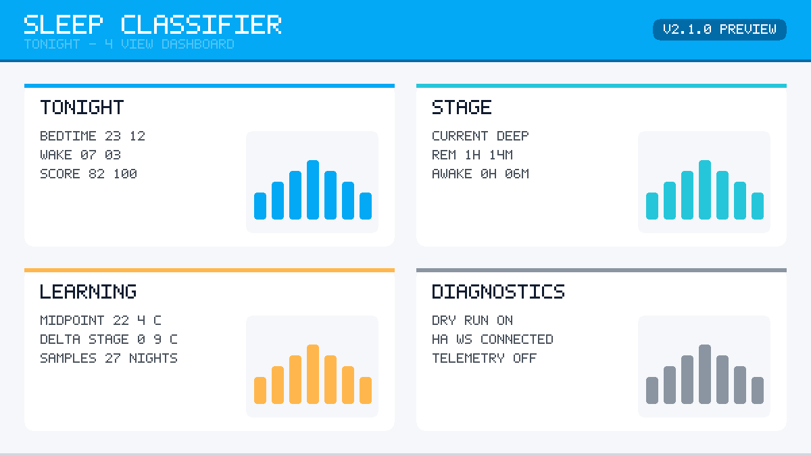

# Sleep Classifier — Home Assistant 智能睡眠 Add-on

[](https://github.com/sponsors/LiangyuLu-lly)

**一句话介绍**：从你自己的睡眠历史中学习最佳卧室环境，然后在整夜、整周、整季中持续自动调节温度/湿度/灯光/风扇，让你每晚都睡在"最好的那几晚"的环境里。

---

## 为什么不一样

不同于"按睡眠阶段套模板"的普通自动化，Sleep Classifier 自 v3.0.0 起在 v2.x 的 4 个时间尺度之上叠加了 4 个本地算法模块（默认开启，可独立关闭，加载或运行异常 ≥ 3 次自动停用并字节级回退到 v2.1.0 行为）。下文每条「数学保证」均带「在 X 假设下成立」前缀，仅描述算法的收敛 / 覆盖性质，**不构成临床疗效声明**（详见 [`MEDICAL_DISCLAIMER.md`](MEDICAL_DISCLAIMER.md)）。

### 4 个算法护城河

- **BAO — 贝叶斯优化器（GP + Thompson Sampling）**
  用高斯过程后验取代单点中位数，按 `exploration_rate` 在环境参数空间中做探索 / 利用决策。**数学保证**：在 RBF kernel + 加性高斯噪声假设下成立，GP-UCB 类策略的累积 regret 满足次线性界 `O(√(T · γ_T))`，且 wind-down 与维度锁定时强制 exploit，不影响夜内稳定性。
- **CAE — 因果归因引擎（do-calculus + bootstrap 95% CI）**
  把"昨晚为什么睡得差"拆成 6 个因子（温度 / 湿度 / 亮度 / 风扇 / 入睡时间 / 工作日），用反事实推断给出每个因子的效应点估计 + 95% 置信区间。**数学保证**：在 6 因子 DAG 结构正确指定 + 观测 IID 假设下成立，合成 null 因子上 bootstrap 95% CI 覆盖率 ≥ 92%；置信区间跨 0 时归因解释会自动追加「（统计显著性弱）」。
- **PP — 群体先验（8000+ 受试者夜 PSG 训练 prior）**
  出厂内置由 [MESA + SHHS](docs/POPULATION_PRIOR.md) 共 ~8497 受试者夜聚合而成的 hierarchical Bayesian prior，按 `(age_band, sex, chronotype, season)` 4 维分桶（最大 180 桶）。**数学保证**：在桶内样本 `n_samples ≥ 50` 的假设下成立，N=0 新用户直接收敛到对应桶的群体后验均值，N=14 时 prior 权重指数衰减到 ≤ 0.1；样本不足时按 sex → chronotype → age_band 顺序逐层放宽，记录 `fallback_level ∈ {0,1,2,3}` 全程可审计。详见 [`docs/POPULATION_PRIOR.md`](docs/POPULATION_PRIOR.md)（含 NSRR DUA 摘要、桶定义、伦理审查说明）。
- **EMST — 端侧 stage 预测（60 秒提前控制）**
  INT8 量化 ONNX 模型（≤ 80 KB）在端侧推理未来 60 秒最可能 stage 的概率向量（AWAKE / LIGHT / DEEP / REM），单次推理 ≤ 50 ms。**数学保证**：在设备响应时间 ≥ 60 秒的假设下成立——LIGHT → DEEP 转换被高置信预测时（confidence ≥ 0.6），空调 / 电热毯 / 地暖会被提前 60 秒按 DEEP 的 setpoint 启动。**60 秒提前控制对快速响应设备（LED / 风扇 / 智能灯）无明显收益，仅对慢响应设备（空调 / 电热毯 / 地暖）有意义**；7 晚命中率 < 70% 持续 3 晚自动停用。

> 🎁 **出厂带 8000+ 受试者 PSG 训练 prior**：v3.0.0 安装后首晚即可命中合适的桶级初值，新用户不必从零冷启动。Prior pickle 仅保存桶级聚合统计（均值 / 方差 / 样本数），不含任何个体可还原信息；数据来源、引用 DOI、桶定义、NSRR DUA 摘要详见 [`docs/POPULATION_PRIOR.md`](docs/POPULATION_PRIOR.md)。

---

## 硬件需求 / Hardware Required

> **还没有睡眠分期传感器？从这里开始。**
> **No sleep-stage sensor? Start here.**

本 Add-on 需要一个能输出睡眠分期（AWAKE / LIGHT / DEEP / REM）的硬件设备才能运行。
详细的推荐硬件清单、价格区间与 HA 接入路径请参阅 👉 [`docs/HARDWARE.md`](docs/HARDWARE.md)

---

## 演示 / Demo

> 下面是 Sleep Classifier 运行 30 天后的 Lovelace 4-view 仪表板概览。



> 🎬 视频演示：请参见 [`assets/screenshots/`](assets/screenshots/) 目录中的 demo 录屏或外链视频。

> ⚠️ 本 Add-on 不是医疗产品，不提供临床诊断或医疗建议。详见 [`MEDICAL_DISCLAIMER.md`](MEDICAL_DISCLAIMER.md)。

---

## 30 天你会看到什么

> ℹ️ 以下数据描述的是系统行为，非医疗诊断。详见 [`MEDICAL_DISCLAIMER.md`](MEDICAL_DISCLAIMER.md)。

| 时间节点 | 系统状态 | 你会感受到 |
|---|---|---|
| **第 1 天** | `dry_run=true`，系统只观察不动作。首晚诊断报告出现在日志中 | Lovelace 上能看到实时睡眠阶段、置信度、session 时长 |
| **第 3 天** | 学习器积累 ≥3 个 session，`recommendation_explain` 从 `not_ready` 变为 `ready` | 推荐入睡时间、最佳环境参数开始显示真实值 |
| **第 7 天** | 关闭 `dry_run`，控制器开始下发设定点；per-stage deltas 进入 `learning` 状态 | 入睡前空调自动预冷，深睡时灯光自动关闭 |
| **第 14 天** | 指数衰减半衰期到达，季节适应开始生效；ESS 可能达到阈值 | per-stage deltas 可能升级为 `personalised`，温差/亮度差来自你自己的数据 |
| **第 30 天** | 工作日/周末分桶稳定，k-NN 邻居池充足，睡眠债追踪有意义 | 系统完全个性化：不同日子、不同季节、不同入睡时间都有针对性推荐 |

---

## 真实使用效果 / Real-world Results

> 以下数据来自项目维护者本人 30 天真实使用记录（已匿名化）。


- 推荐入睡时间在第 7 天稳定，工作日与周末差异约 45 分钟。
- 学习到的环境参数（温度 / 湿度 / 灯光）在第 14 天达到 `personalised` 阶段。
- 睡眠质量分在第 3 周明显上升（碎片化惩罚降低）。

更多案例研究请参阅 [`docs/CASE_STUDIES.md`](docs/CASE_STUDIES.md)。

> ⚠️ 以上数据仅为个人体验，不构成医疗建议或临床证据。详见 [`MEDICAL_DISCLAIMER.md`](MEDICAL_DISCLAIMER.md)。

### Beta Tester Program

我们正在寻找早期用户参与 Beta 测试计划：

- 📸 提交你的 30 天使用截图（匿名化），换取在 README 与 [`docs/CASE_STUDIES.md`](docs/CASE_STUDIES.md) 的署名展示（完全 opt-in）。
- 🔒 隐私保障：我们不会展示任何具体 entity_id、HA 实例 URL、家庭住址或生物识别信息。
- ✍️ 所有展示需取得你的书面同意（GitHub issue / PR comment 留痕即可），你可以随时要求撤回。

有兴趣？请提交一个 GitHub Issue 并标注 `beta-tester` 标签。

---

## 功能列表 — 20 个 Sensor 一览

> ℹ️ 以下 sensor 仅供参考与自动化使用，不构成医学诊断。详见 [`MEDICAL_DISCLAIMER.md`](MEDICAL_DISCLAIMER.md)。

| # | Entity ID | 说明 | 示例值 |
|---|---|---|---|
| 1 | `sensor.sleep_classifier_stage` | 当前睡眠阶段 | `DEEP` |
| 2 | `sensor.sleep_classifier_confidence` | 阶段置信度 | `92` |
| 3 | `sensor.sleep_classifier_quality_score` | 本次 session 质量分 | `78` |
| 4 | `sensor.sleep_classifier_session_duration` | session 已持续秒数 | `21600` |
| 5 | `sensor.sleep_classifier_last_action` | 最近一次设备控制摘要 | `climate.set_temperature → climate.bedroom_ac` |
| 6 | `sensor.sleep_classifier_health` | 聚合健康状态 | `healthy` / `degraded` / `error` |
| 7 | `sensor.sleep_classifier_debt_hours` | 睡眠债（小时） | `2.5` |
| 8 | `sensor.sleep_classifier_recommended_bedtime` | 今晚推荐入睡时间 | `2026-05-15T23:15:00` |
| 9 | `sensor.sleep_classifier_wake_decision` | 智能唤醒决策 | `hold` / `pre_ramp` / `fire_now` |
| 10 | `sensor.sleep_classifier_soundscape` | 当前白噪音/自然音 | `pink_noise` / `rain` / `off` |
| 11 | `sensor.sleep_classifier_learned_bedtime_workday` | 学习到的工作日入睡时间 | `23:20` |
| 12 | `sensor.sleep_classifier_learned_bedtime_weekend` | 学习到的周末入睡时间 | `00:05` |
| 13 | `sensor.sleep_classifier_learned_environment` | 学习到的最佳环境 | `19.5 °C / 50 % / 5 %` |
| 14 | `sensor.sleep_classifier_recommendation_explain` | 推荐理由状态 | `ready` / `not_ready` |
| 15 | `sensor.sleep_classifier_per_stage_deltas` | 各阶段学习偏移状态 | `clinical` / `learning` / `personalised` |
| 16 | `sensor.sleep_classifier_apnea_index` | 呼吸暂停趋势 | `pending_consent` / `green` / `amber` / `red` |
| 17 | `sensor.sleep_classifier_quality_architecture` | 质量子分：睡眠结构 | `82` |
| 18 | `sensor.sleep_classifier_quality_efficiency` | 质量子分：睡眠效率 | `91` |
| 19 | `sensor.sleep_classifier_quality_fragmentation` | 质量子分：碎片化 | `75` |
| 20 | `sensor.sleep_classifier_quality_onset` | 质量子分：入睡速度 | `88` |

---

## 安装步骤（简化版）

```text
1. 运行 prepare.bat / prepare.sh  →  同步源码到 rootfs/
2. git push                       →  发布到 GitHub
3. HA Web UI → 设置 → 加载项 → 加载项商店 → ⋮ → 仓库 → 粘贴仓库 URL
4. 安装 "Sleep Classifier"        →  Supervisor 构建镜像（~1-3 分钟）
5. 配置 → sleep_stage_source = sensor.<你的睡眠阶段实体>
6. 启动
```

> 详细安装指南请参阅 [INSTALL.md](INSTALL.md)

---

## 配置速查

| 配置项 | 默认值 | 说明 |
|---|---|---|
| `sleep_stage_source` | `""` | **必填**。你的睡眠阶段实体 ID |
| `dry_run` | `true` | 首次安装保持 true，验证无误后改为 false |
| `area` | `""` | 限制设备发现范围，留空扫描所有房间 |
| `infer_interval` | `30` | 控制决策间隔（秒） |
| `wind_down_minutes` | `30` | 入睡前多少分钟开始预冷 |
| `min_stage_dwell_seconds` | `60` | 阶段去抖动阈值（秒） |
| `deadband_temperature_c` | `0.5` | 温度死区（°C） |
| `whitenoise_target` | `""` | 白噪音播放器实体 |
| `wake_window_start` / `end` | `""` | 智能唤醒窗口（如 `07:00` / `07:30`） |
| `feedback_entity` | `""` | 晨起主观评分 `input_number` |
| `volume_feedback_entity` | `""` | 白噪音音量反馈 `input_number`（实时调节） |

---

## 常见问题 FAQ

<details>
<summary><strong>1. 安装时一直卡在 "Building"</strong></summary>

Pi 4B 首次安装需要下载约 10 MB 的 arm64 wheels，通常 1-3 分钟完成。如果超过 5 分钟，检查网络连接或尝试配置镜像源。
</details>

<details>
<summary><strong>2. sensor 显示 unknown / unavailable</strong></summary>

- 确认 `sleep_stage_source` 填写正确（开发者工具 → 状态 中搜索）
- 确认你的手环/手表集成已正常工作且在 HA 中有实体
- 首次启动后需要等待第一次阶段变化事件
</details>

<details>
<summary><strong>3. quality_score 很低（< 50）</strong></summary>

质量分基于 DEEP/REM 占比和碎片化程度。如果你的手环报告的深睡/REM 时间本身就少，分数会偏低。这不代表系统有问题——它反映的是你的实际睡眠结构。
</details>

<details>
<summary><strong>4. 设备不动（空调/灯不响应）</strong></summary>

- 确认 `dry_run` 已设为 `false`
- 检查 `sensor.sleep_classifier_last_action` 的 `executed` 属性
- 确认目标设备支持对应服务（如空调需支持 `set_temperature`）
- 查看 `skipped_by_capability` / `skipped_unavailable` 属性
</details>

<details>
<summary><strong>5. 手环断连后系统锁死在某个阶段</strong></summary>

v1.6.3+ 有 stale 检测：当阶段源超过一定时间未更新，系统会暂停控制并在 Lovelace 显示 "tracker not reporting"。手环重新连接后自动恢复。
</details>

<details>
<summary><strong>6. 午睡被记录进学习数据</strong></summary>

v1.8.0+ 有午睡过滤：`session_lifecycle.min_session_minutes`（默认 60）以下的 session 不会进入偏好学习器，不会污染夜间推荐。
</details>

<details>
<summary><strong>7. 学习多久才有效果？</strong></summary>

最少 3 个完整 session 后推荐开始生效。7-14 天后 per-stage deltas 可能升级为 `personalised`。30 天后系统完全个性化。
</details>

<details>
<summary><strong>8. 如何重置学习数据？</strong></summary>

通过 SSH Add-on 删除 `/data/user_preferences.json`，然后重启 Sleep Classifier。系统会从零开始学习。
</details>

<details>
<summary><strong>9. Why HA only?（为什么只支持 Home Assistant？）</strong></summary>

本 Add-on 的核心学习器（preference_learner、sleep_quality_score）是纯 Python 模块，理论上可以从 HA Add-on 中抽出复用。v2.2.0+ 路线图中已规划 Matter sleep tracker integration、SmartThings webhook bridge、Apple Health export 等扩展方向。详见 [`docs/ROADMAP.md` §Device ecosystem expansion](docs/ROADMAP.md#device-ecosystem-expansion)。
</details>

<details>
<summary><strong>10. Two people sharing a bed?（两人共睡一床怎么办？）</strong></summary>

v2.1.0 仍假设「单户 + 单房间」。夫妻对体感温度需求不同的场景将在 v2.2.0+ 支持（每用户独立偏好文件、per-room 设备分组、不同唤醒窗口协同）。详见 [`docs/ROADMAP.md` §Multi-resident / multi-room](docs/ROADMAP.md#multi-resident--multi-room)。
</details>

> 更多问题请参阅 [docs/FAQ.md](docs/FAQ.md)（15 条完整 FAQ）

---

## 版本历史摘要

> ℹ️ 所有涉及睡眠与健康数据的功能均为非医疗用途。详见 [`MEDICAL_DISCLAIMER.md`](MEDICAL_DISCLAIMER.md)。

| 版本 | 日期 | 主要变更 |
|---|---|---|
| v2.0.0 | 2026-05-16 | 商业化最终版：中文文档全覆盖、双语日志、白噪音音量反馈、`min_ha_version` 声明、3-view Lovelace 模板 |
| v1.9.0 | 2026-05-15 | 用户温度覆盖、首晚诊断报告、DST 稳健性、事件风暴压力测试 |
| v1.8.0 | 2026-05-14 | 聚合健康 sensor、质量子分 ×4、午睡过滤、备份机制、端到端集成测试 |
| v1.7.1 | 2026-05-13 | 设备 off-state 自动开启、unavailable 跳过、用户手动覆盖保护 |
| v1.7.0 | 2026-05-13 | 呼吸暂停趋势检测（consent-gated） |
| v1.6.x | 2026-05-12 | 能力门控、stale 环境检测、session 生命周期、WebSocket 重连 |
| v1.5.0 | 2026-05-12 | Per-stage 学习型 deltas（ESS 保护） |
| v1.4.0 | 2026-05-12 | 设备响应时间预判、wind-down 预冷、阶段去抖动 |
| v1.3.0 | 2026-05-12 | 外部睡眠阶段订阅、偏好学习器、移除本地模型 |

---

## 30 天使用指南

以下是从安装到完全个性化的详细时间线，帮助你了解每个阶段系统在做什么、你应该关注什么。

> ℹ️ 本指南描述的是系统自动化行为，不构成医学建议。详见 [`MEDICAL_DISCLAIMER.md`](MEDICAL_DISCLAIMER.md)。

### 第 1 天：观察模式

- 保持 `dry_run=true`，系统只观察不动作
- 确认 `sensor.sleep_classifier_stage` 有数据（应显示 AWAKE / LIGHT / DEEP / REM）
- 查看 Add-on 日志，确认 WebSocket 连接成功、首晚诊断报告出现
- Lovelace 上应能看到实时阶段、置信度、session 时长（[非医疗诊断](MEDICAL_DISCLAIMER.md)）

### 第 2 天：验证控制链路

- 将 `dry_run` 改为 `false`
- 观察 `sensor.sleep_classifier_last_action` 是否有设备调控记录
- 检查 `executed` 属性是否为 `true`
- 如果设备没反应，检查 `skipped_by_capability` 和 `skipped_unavailable`

### 第 3 天：学习器启动

- `sensor.sleep_classifier_learned_environment` 从 "—" 变成推荐值（需要 ≥3 个完整 session）
- `sensor.sleep_classifier_recommendation_explain` 从 `not_ready` 变为 `ready`
- 推荐入睡时间开始显示真实值

### 第 7 天：入睡时间学习

- `sensor.sleep_classifier_learned_bedtime_workday` / `_weekend` 出现真实时间
- `sensor.sleep_classifier_debt_hours` 开始有意义的追踪
- per-stage deltas 进入 `learning` 状态
- wind-down 预冷开始在入睡前自动触发

### 第 14 天：个性化升级

- `sensor.sleep_classifier_per_stage_deltas` 从 `clinical` → `learning`
- 指数衰减半衰期到达，季节适应开始生效
- ESS（有效样本量）可能达到阈值，部分字段升级为 `personalised`
- 温差/亮度差开始来自你自己的数据而非临床默认值

### 第 30 天：完全个性化

- `sensor.sleep_classifier_per_stage_deltas` → `personalised`
- 工作日/周末分桶稳定，k-NN 邻居池充足
- 系统完全个性化：不同日子、不同季节、不同入睡时间都有针对性推荐
- 睡眠债追踪有意义，恢复计划可参考

> 💡 如果中途重置了学习数据（删除 `/data/user_preferences.json`），以上时间线从头开始。

---

## Medical Advisors / 医学顾问

> ℹ️ 详见 [`MEDICAL_DISCLAIMER.md`](MEDICAL_DISCLAIMER.md)。

项目目前由开源社区维护，**正在寻找**具有以下背景的志愿顾问加入（详见 [`MEDICAL_DISCLAIMER.md`](MEDICAL_DISCLAIMER.md)）：

- Sleep Medicine（睡眠医学）
- Polysomnography（多导睡眠监测）
- Smart-home Health（智能家居健康应用）

如果你有相关专业背景并愿意贡献，请联系：`liangyulu781+security@gmail.com`（与 [SECURITY.md](SECURITY.md) 使用相同邮箱）。

> ⚠️ **重要声明**：目前所有医学性陈述均为非临床、非诊断、非医疗建议。在医学顾问正式加入项目之前，本 Add-on 的任何输出都不应被解读为医疗指导。详见 [`MEDICAL_DISCLAIMER.md`](MEDICAL_DISCLAIMER.md)。

---

## Support the Project / 支持本项目

如果 Sleep Classifier 对你有帮助，欢迎通过以下方式支持项目持续开发：

| 平台 | 链接 |
|---|---|
| **GitHub Sponsors** | [github.com/sponsors/LiangyuLu-lly](https://github.com/sponsors/LiangyuLu-lly) |
| **爱发电** | [afdian.com/a/LiangyuLu-lly](https://afdian.com/a/LiangyuLu-lly) |
| **Buy Me a Coffee** | [buymeacoffee.com/LiangyuLu-lly](https://www.buymeacoffee.com/LiangyuLu-lly) |

> 💡 **MIT 功能永不付费承诺**：现有 MIT License 下交付的全部功能（包括 preference learner、smart environment controller、smart wake、sleep quality score、sleep debt、Lovelace dashboard、Web UI、telemetry / upgrade notifier 等），**永远不会**被移除或迁移到付费版本。未来的付费方向仅针对增量服务（托管服务、付费技术支持、推荐硬件套件），不会对现有功能做「专业版」「企业版」分层。这一承诺与 [`docs/ROADMAP.md`](docs/ROADMAP.md) 的 Commercial roadmap 章节一致。

---

<!-- ## In the press / community -->
<!-- R15.3：首次外部社区发布（Reddit / HN / HA Community Forum / 知乎 / 少数派）后 -->
<!-- 在此取消注释并列出对应链接。首次外部发布前此 section 不强制展示，避免空 -->
<!-- placeholder 损害可信度。 -->
<!-- 未来格式示例：                                                               -->
<!-- | 平台 | 标题 | 链接 |                                                       -->
<!-- |---|---|---|                                                                  -->
<!-- | Reddit r/homeautomation | 30-day case study... | [link](...) |              -->

---

## 许可证

MIT License

> 💡 现有 MIT License 功能永远不会被移到付费版（详见上方「Support the Project」段与 [`docs/ROADMAP.md`](docs/ROADMAP.md)）。

## 项目地址

<https://github.com/LiangyuLu-lly/HA-sleep>
